# FORAGE WITH ME
## Art Style Guide

**Version:** 1.0  
**Last Updated:** March 4, 2025  
**Art Director:** TBD  

---

## Table of Contents
1. [Visual Style Overview](#visual-style-overview)
2. [Color Palette](#color-palette)
3. [Character Design](#character-design)
4. [Environment Design](#environment-design)
5. [UI Design](#ui-design)
6. [Animation Guidelines](#animation-guidelines)
7. [Technical Specifications](#technical-specifications)
8. [Asset Production Pipeline](#asset-production-pipeline)
9. [Reference Images](#reference-images)

---

## Visual Style Overview

### Core Artistic Vision
"Forage With Me" features a charming, stylized 3D art style that balances whimsy with natural beauty. The visual aesthetic draws inspiration from Studio Ghibli films, modern cozy games like Animal Crossing, and traditional botanical illustrations. The world should feel inviting and magical, yet grounded in recognizable natural elements.

### Key Visual Pillars
1. **Charming Stylization:** Slightly exaggerated proportions and simplified details that emphasize character and readability
2. **Natural Beauty:** Rich environments with attention to botanical accuracy in a stylized form
3. **Seasonal Expressiveness:** Dramatic visual changes across seasons that affect color, lighting, and atmosphere
4. **Cozy Warmth:** Inviting spaces with warm lighting and comfortable details
5. **Visual Clarity:** Clear visual language that helps players identify interactive elements

### Art Style References
- **Character Style:** Animal Crossing, Bugsnax, Okami
- **Environment Style:** Legend of Zelda: Wind Waker, Eastward, Yonder: The Cloud Catcher Chronicles
- **Lighting:** Studio Ghibli films, particularly "The Secret World of Arrietty" and "My Neighbor Totoro"
- **UI:** Stardew Valley, Spiritfarer, Garden Story

---

## Color Palette

### Core Palette
The game's core palette consists of rich, slightly desaturated colors that evoke a natural woodland setting while maintaining visual vibrancy.

```mermaid
graph TD
    subgraph Core Palette
        CP1[#2C4024: Deep Forest Green]
        CP2[#5A7247: Moss Green]
        CP3[#8F9E6F: Sage]
        CP4[#D0BA7D: Wheat]
        CP5[#AA6E39: Cedar]
        CP6[#7D4E24: Chestnut]
        CP7[#BD7B4F: Terracotta]
    end
```



### Seasonal Palettes

#### Spring


#### Summer


#### Fall


#### Winter


### UI Palette


---

## Character Design

### Character Proportions
- Anthropomorphic animal characters with slightly exaggerated proportions
- Head-to-body ratio of approximately 1:3
- Large, expressive eyes
- Simplified paws/hands with four fingers
- Heights vary by species but average 5-6 heads tall
- The raccoon player character should be of medium height compared to other villagers

### Character Style Guidelines
- Clean, simple silhouettes with recognizable animal features
- Minimal texture detail in favor of strong color and shape
- Soft, rounded forms with some angular elements for visual interest
- Clothing should reflect profession and personality
- Each character should have a unique silhouette recognizable from a distance

### Player Character (Raccoon)
- **Defining Features:** Mask-like face markings, ringed tail, dexterous paws
- **Customization:** Variations in fur patterns, eye color, and clothing options
- **Size:** Medium height, nimble build
- **Special Characteristics:** Expressive hands for foraging animations, detail in the tail for expressiveness

### Villager Character Templates
- **Small Animals (Squirrels, Rabbits):** Quick movements, large eyes, tufted ears or tails
- **Medium Animals (Foxes, Badgers):** Balanced proportions, distinctive facial features
- **Large Animals (Deer, Bears):** Slightly more realistic proportions, imposing presence
- **Birds (Owls, Jays):** Wing-like arms, distinctive crests or beaks
- **Aquatic Animals (Otters, Frogs):** Smoother textures, webbed appendages

---

## Environment Design

### World Style Guidelines
- Stylized natural environments with slightly exaggerated scale
- Rich detail in interactive elements (plants, forageables)
- Clear visual language for pathways and boundaries
- Distinctive visual themes for each biome
- Dramatic seasonal changes affecting colors, lighting, and foliage

### Village Design
- Cozy woodland architecture with organic forms
- Buildings integrated with natural elements (trees, hills)
- Warm lighting from windows and lanterns
- Clear paths connecting important locations
- Unique architectural elements for each villager's home reflecting their species and personality

### Player Home Design
- **Tier 1:** Small, slightly rustic cottage with basic amenities
- **Tier 2:** Expanded structure with added rooms and decorative elements
- **Tier 3:** Fully-realized home with workshop additions, greenhouse, and personalized details

### Biome Visual Themes

#### Forest
- Dense, varied vegetation with dappled lighting
- Rich undergrowth with mushrooms and forest floor details
- Vertical elements (trees) creating layered exploration spaces
- Mystical elements in deeper forest areas

#### Plains
- Open, rolling landscape with tall grasses
- Scattered wildflowers and herbs in vibrant patches
- Rocky outcroppings as visual landmarks
- Big sky with dramatic cloud formations

#### River/Riverside
- Winding water with variable flow effects
- Lush riverside vegetation with overhanging elements
- Varied riverbank textures (sand, stones, mud)
- Pools and rapids creating visual rhythm

#### Lake
- Clear, reflective water surface with subtle movement
- Distinctive shore environments (sandy, rocky, reedy)
- Lily pads and floating elements
- Islands and distinctive lakeside landmarks

### Seasonal Variation Guidelines
- **Spring:** New growth, blooming flowers, soft lighting, rainfall effects
- **Summer:** Full foliage, vibrant colors, strong lighting, heat haze effects
- **Fall:** Color-changing leaves, falling leaf particles, golden lighting, mist effects
- **Winter:** Snow coverage, bare trees, cool lighting, ice formations, breath effects

---

## UI Design

### UI Philosophy
The UI should feel organic and handcrafted, reinforcing the natural themes of the game. Elements should appear as if drawn or crafted by the village residents.

### Key UI Features
- **Natural Materials:** UI elements should evoke parchment, wood, and natural fibers
- **Hand-Drawn Style:** Icons and decorative elements with a slightly imperfect, illustrated quality
- **Botanical Motifs:** Plant elements as decorative borders and dividers
- **Clear Information Hierarchy:** Despite the artistic style, information should be immediately readable

### HUD Design
- Minimal permanent HUD elements
- Time/season indicator resembling a small sundial or seasonal flower
- Energy meter as a growing/shrinking plant
- Contextual interaction prompts appearing near interactive objects

### Menu Designs
- **Inventory:** Organized as a collector's journal with sketched item illustrations
- **Recipe Book:** Handwritten recipes with botanical illustrations
- **Map:** Hand-drawn map with ink and watercolor styling
- **Relationship Menu:** Tree-like diagram showing connections to villagers

### Icon Style
- Consistent stroke weight and simplification level
- Hand-drawn aesthetic with botanical inspiration
- Clear silhouettes for immediate recognition
- Color-coding system matching item categories

---

## Animation Guidelines

### Character Animation Style
- Slightly exaggerated, bouncy movements
- Emphasis on personality in idle animations
- Species-specific movement characteristics
- 12-16 frames per second for stylized effect

### Key Character Animations
- **Locomotion:** Walk, run, tired walk
- **Foraging:** Different animations for various gathering techniques
- **Crafting:** Cooking, medicine-making
- **Social:** Greeting, thinking, happy, disappointed
- **Environmental:** Cold, hot, wet, surprised

### Environmental Animation
- Gentle wind effects on foliage
- Water ripples and flow
- Weather effects (rain, snow, leaves)
- Subtle ambient movement in all scenes

### UI Animation
- Soft, bouncy transitions between states
- Subtle breathing animations for organic elements
- Hand-drawn animation frames for special effects

---

## Technical Specifications

### Modeling Guidelines
- **Poly Budget:**
  - Player Character: 6,000-8,000 triangles
  - Villager Characters: 4,000-6,000 triangles
  - Buildings: 10,000-15,000 triangles
  - Environment Props: 500-3,000 triangles
  - Forageable Items: 200-500 triangles

- **Texture Sizes:**
  - Character Textures: 2048x2048
  - Building Textures: 2048x2048
  - Environment Textures: 1024x1024
  - Prop Textures: 512x512
  - UI Elements: 256x256 to 512x512

### Shading Approach
- Cel-shading with soft gradients
- Hand-painted textures with minimal normal mapping
- Rim lighting for character definition
- Subtle specular highlights

### Lighting Style
- Warm, directional main light
- Soft fill lights to prevent harsh shadows
- Colored bounce light reflecting environment
- Subtle bloom effect for magic and highlight elements

---

## Asset Production Pipeline

### Concept Art Process
1. Mood board and reference collection
2. Rough sketches exploring multiple directions
3. Refined concept art for approved direction
4. Color studies and material callouts
5. Final concept sheet with multiple views/variations

### 3D Asset Workflow
1. Blockout based on approved concept
2. High-poly sculpt (if needed)
3. Low-poly model
4. UV mapping
5. Texture painting
6. Rigging (for animated assets)
7. Animation
8. Implementation in engine

### Naming Conventions
- Character: CH_[Character Name]_[Asset Type]
- Environment: ENV_[Biome]_[Asset Name]
- Props: PROP_[Category]_[Asset Name]
- UI: UI_[Menu]_[Element]
- Textures: T_[Asset Name]_[Map Type]

### File Organization
```
Art/
├── Characters/
│   ├── Player/
│   ├── Villagers/
│   └── Concepts/
├── Environments/
│   ├── Village/
│   ├── Forest/
│   ├── Plains/
│   ├── River/
│   ├── Lake/
│   └── Concepts/
├── Props/
│   ├── Forageables/
│   ├── Tools/
│   ├── Furniture/
│   └── Concepts/
├── UI/
│   ├── HUD/
│   ├── Menus/
│   ├── Icons/
│   └── Concepts/
└── VFX/
    ├── Weather/
    ├── Particles/
    └── Concepts/
```

---

## Reference Images

*Note: This section would contain actual reference images, mood boards, and early concept sketches to guide the art team. For this document template, these references are described but would be actual images in the final document.*

### Character Reference Board
Visual references for the anthropomorphic style, showing the balance between animal features and human-like expressions. Include examples from Animal Crossing, Bugsnax, and other stylized animal character designs.

### Environment Reference Board
References showing the level of stylization for natural environments, with examples of how botanical elements should be simplified while maintaining recognizability.

### Color Studies
Sample color compositions for each biome in each season, demonstrating how the palette shifts throughout the year while maintaining visual cohesion.

### UI Mock-ups
Early designs for key UI elements, showing the hand-crafted aesthetic and information layout.

### Concept Sketches
Initial character and environment thumbnails exploring different directions before settling on the final style.
