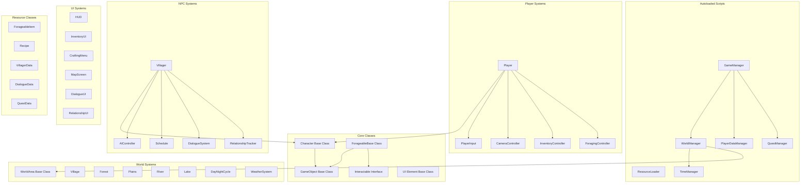

# FORAGE WITH ME
## Technical Design Document (TDD)

**Version:** 1.0  
**Last Updated:** March 4, 2025  
**Technical Lead:** TBD  

---

## Table of Contents
1. [Technical Overview](#technical-overview)
2. [Architecture](#architecture)
3. [Core Systems](#core-systems)
4. [Gameplay Mechanics Implementation](#gameplay-mechanics-implementation)
5. [Performance Considerations](#performance-considerations)
6. [Tools & Third-Party Libraries](#tools--third-party-libraries)
7. [Testing & Quality Assurance](#testing--quality-assurance)
8. [Platform-Specific Considerations](#platform-specific-considerations)

---

## Technical Overview

### Engine & Technology
"Forage With Me" is developed using Godot 4.3, chosen for its open-source nature, ease of use for small teams, and robust 3D capabilities. The project uses GDScript for primary development, with some shader work in Godot's shader language.

### Technical Goals
1. Create a smooth, responsive player experience on modest hardware
2. Implement efficient systems for seasonal changes and time management
3. Develop a flexible crafting and inventory system
4. Create believable AI for village inhabitants
5. Ensure optimized performance across the target platforms

### System Requirements
- **Minimum:**
  - OS: Windows 10 (64-bit)
  - Processor: Intel Core i5-4460 or AMD FX-6300
  - Memory: 8 GB RAM
  - Graphics: NVIDIA GeForce GTX 760 or AMD Radeon R7 260x
  - DirectX: Version 11
  - Storage: 4 GB available space

- **Recommended:**
  - OS: Windows 10/11 (64-bit)
  - Processor: Intel Core i7-6700 or AMD Ryzen 5 1600
  - Memory: 16 GB RAM
  - Graphics: NVIDIA GeForce GTX 1060 or AMD Radeon RX 580
  - DirectX: Version 12
  - Storage: 4 GB available space

---

## Architecture

### Code Structure Overview



### Singleton Patterns
The game utilizes several autoloaded singleton scripts to manage global state and systems:

- **GameManager:** Oversees the overall game state, handles pausing, and coordinates between other managers
- **PlayerDataManager:** Manages player inventory, relationships, and persistent data
- **ResourceLoader:** Handles the loading and caching of resources and items
- **WorldManager:** Coordinates between different world areas and manages transitions
- **TimeManager:** Controls the day/night cycle and seasonal changes
- **QuestManager:** Tracks active quests and completion status

### Signal System
Godot's signal system is used extensively for decoupled communication between systems. Key signal patterns include:

- **State Change Signals:** Broadcast changes in game state, time of day, or seasons
- **Inventory Signals:** Communicate changes to player inventory
- **Interaction Signals:** Notify when players interact with objects or NPCs
- **UI Update Signals:** Trigger UI refreshes when underlying data changes

---

## Core Systems

### Save/Load System
- **Format:** JSON-based save files for human readability and debugging
- **Storage Location:** User directory with versioned save files
- **Autosave:** Triggered at the end of each in-game day
- **Save Data:** Player progress, inventory, relationships, world state
- **Implementation:** Using Godot's File system with custom serialization

```gdscript
# Example Save System Pseudocode
func save_game():
    var save_data = {
        "player": PlayerDataManager.get_serialized_data(),
        "world": WorldManager.get_serialized_data(),
        "time": TimeManager.get_serialized_data(),
        "quests": QuestManager.get_serialized_data(),
        "version": GAME_VERSION
    }
    
    var save_file = FileAccess.open(SAVE_PATH, FileAccess.WRITE)
    save_file.store_string(JSON.stringify(save_data))
    save_file.close()
```

### Resource Management
- **Resource Pools:** Central registry for all game resources (items, recipes, dialogues)
- **Lazy Loading:** Only load resources when needed, with preloading for critical assets
- **Resource Cache:** Maintain loaded resources to prevent redundant loading
- **Item Database:** JSON-defined database of all forageables, recipes, and craftable items

### Time System
- **Time Scale:** 1 real-minute = 30 in-game minutes (20 real-minutes per day)
- **Day Structure:** 6:00 AM to 10:00 PM active time (16 hours), 10:00 PM to 6:00 AM sleeping time
- **Season Length:** 7 in-game days per season
- **Year Cycle:** 4 seasons per year
- **Time Effects:** Influences NPC schedules, available forageables, lighting, and events

```gdscript
# Example Time System Pseudocode
func _process(delta):
    current_time_minutes += delta * TIME_SCALE
    if current_time_minutes >= MINUTES_PER_DAY:
        current_time_minutes = 0
        advance_day()
    
    update_day_night_cycle()
    update_npc_schedules()
    update_available_forageables()
```

### Player Control System
- **Movement:** Third-person character controller with WASD movement
- **Camera:** Spring-arm camera with variable zoom levels
- **Interaction:** Ray-cast based interaction system with context-sensitive prompts
- **Animation:** State machine controlling character animations based on actions

---

## Gameplay Mechanics Implementation

### Foraging System
- **Forageable Generation:** Semi-procedural placement based on biome, season, and time
- **Collection Mechanics:** Simple interaction for basic items, minigames for special items
- **Quality System:** Item quality affected by player skill and conditions
- **Respawn Logic:** Daily respawn of common items, longer cooldowns for rare items

```gdscript
# Example Forageable Generation Pseudocode
func populate_forageables(area_node, area_type, season):
    var forageable_list = ResourceLoader.get_forageables_for_area_and_season(area_type, season)
    var spawn_points = area_node.get_node("ForageableSpawnPoints").get_children()
    
    for point in spawn_points:
        if randf() <= point.spawn_chance:
            var valid_forageables = forageable_list.filter(func(item): return item.spawn_requirements.is_met(point))
            if valid_forageables.size() > 0:
                var item_to_spawn = valid_forageables[randi() % valid_forageables.size()]
                var instance = item_to_spawn.scene.instantiate()
                point.add_child(instance)
```

### Inventory System
- **Structure:** Dictionary-based inventory with item IDs and quantities
- **Categories:** Organized by item type (plants, food, medicine, tools)
- **Weight System:** Limited carrying capacity based on item weight
- **Storage:** Additional storage at player home
- **UI Representation:** Grid-based inventory with detailed item information on selection

### Crafting System
- **Recipe Discovery:** Recipes learned through villager interactions and exploration
- **Crafting Process:** Select recipe, confirm ingredients, optional minigame for quality
- **Quality Factors:** Ingredient quality, player skill, equipment tier
- **Special Recipes:** Season-specific and festival-related special recipes
- **Failures:** Possibility of failed crafting attempts returning partial ingredients

```gdscript
# Example Crafting System Pseudocode
func craft_item(recipe_id, inventory_controller):
    var recipe = ResourceLoader.get_recipe(recipe_id)
    var can_craft = true
    
    # Check for ingredients
    for ingredient in recipe.ingredients:
        if not inventory_controller.has_item(ingredient.id, ingredient.amount):
            can_craft = false
            break
    
    if can_craft:
        # Remove ingredients
        for ingredient in recipe.ingredients:
            inventory_controller.remove_item(ingredient.id, ingredient.amount)
        
        # Determine quality based on player skill and ingredients
        var quality = calculate_quality(recipe)
        
        # Add crafted item
        inventory_controller.add_item(recipe.result_id, recipe.result_amount, quality)
        return true
    
    return false
```

### Relationship System
- **Data Structure:** Dictionary tracking relationship values with each villager
- **Relationship Building:** Gifting, quest completion, dialogue choices
- **Tiers:** Multiple relationship levels unlocking new dialogue and recipes
- **Preferences:** Each villager has gift preferences affecting relationship gains
- **Events:** Special events at certain relationship thresholds

### Home Upgrade System
- **Upgrade Triggers:** Material collection + relationship requirements
- **Construction Process:** Multi-day building process with villager assistance
- **Material Management:** Resources stored in a special construction chest
- **Visual Changes:** Progressive mesh swapping and additional decoration options
- **Functional Improvements:** Additional crafting stations, storage expansion, etc.

---

## Performance Considerations

### Level of Detail (LOD) System
- Multiple detail levels for distant objects
- Dynamic object culling based on distance and view frustum
- Simplified physics for distant interactions

### Optimization Strategies
- **Object Pooling:** Reuse common objects like forageables and VFX
- **Texture Atlasing:** Combine textures for similar objects to reduce draw calls
- **Occlusion Culling:** Only render what's in the player's field of view
- **Instancing:** Use instanced meshes for repetitive elements like grass
- **Resource Management:** Unload unused resources when changing areas

### Memory Management
- Implement soft references for non-critical resources
- Strategically free resources when changing significant game states
- Batch loading to prevent frame drops

### Target Performance Metrics
- **Frame Rate:** 60 FPS on recommended specs
- **Memory Usage:** Under 2GB RAM
- **Loading Times:** Under 15 seconds for initial load, under 5 seconds for area transitions

---

## Tools & Third-Party Libraries

### External Tools
- **Blender:** 3D modeling and animation
- **Krita/Photoshop:** Texture creation
- **Audacity:** Sound editing
- **FMOD:** Advanced audio implementation (if budget allows)
- **Git/GitHub:** Version control
- **Trello/Notion:** Task management

### Godot Plugins & Add-ons
- **Dialogic:** Advanced dialogue system
- **Scatter:** Environmental object placement
- **Godot Steam API:** Steam integration
- **GUTS:** Unit testing framework
- **Godot Shaders:** Collection of optimized shaders

### Custom Tools
- **Item Database Editor:** Custom editor for creating and balancing items
- **Recipe Creator:** Tool for defining and testing crafting recipes
- **Dialogue Tree Editor:** Visual editor for conversation flows
- **Schedule Builder:** Tool for creating and visualizing NPC schedules

---

## Testing & Quality Assurance

### Testing Approach
- **Unit Testing:** Core gameplay systems (inventory, crafting, saving)
- **Integration Testing:** System interaction (player+world, foraging+inventory)
- **Playtest Sessions:** Weekly internal playtests, monthly external playtests
- **Automated Testing:** Critical path testing for main story progression

### Bug Tracking
- GitHub Issues for bug tracking with custom templates
- Severity classification system (Critical, Major, Minor, Cosmetic)
- Regression testing for fixed issues

### Performance Profiling
- Regular profiling sessions targeting:
  - Frame rate monitoring in complex scenes
  - Memory usage tracking
  - Loading time optimization
  - Draw call reduction

---

## Platform-Specific Considerations

### PC (Steam)
- **Input:** Keyboard/mouse and controller support with remappable controls
- **Graphics Settings:** Scalable settings for various hardware configurations
- **Steam Features:** Achievements, Cloud Saves, Workshop support (future)
- **Distribution:** Steam and optional DRM-free version

### Future Platform Considerations
This section outlines potential console ports (not in initial release):

- **Nintendo Switch:** Performance optimizations, simplified shaders, control scheme adaptation
- **PlayStation/Xbox:** Trophy/Achievement integration, platform certification requirements
