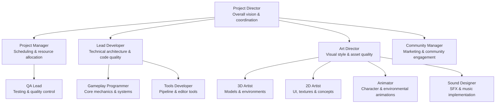
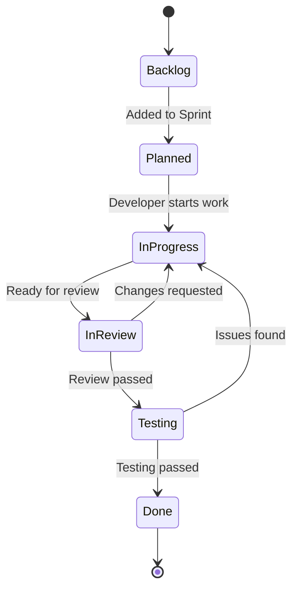
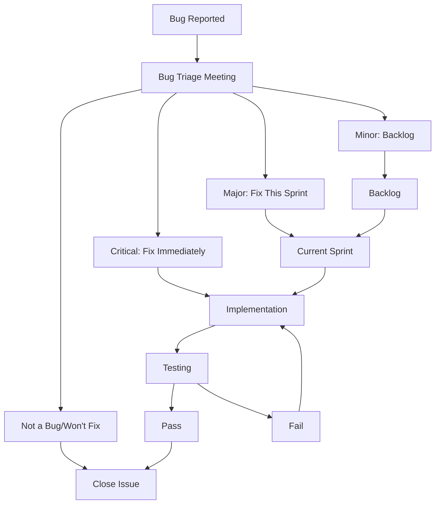

# FORAGE WITH ME
## Project Management Plan

**Version:** 1.0  
**Last Updated:** March 4, 2025  
**Project Manager:** TBD  

---

## Table of Contents
1. [Team Structure](#team-structure)
2. [Communication Plan](#communication-plan)
3. [Development Methodology](#development-methodology)
4. [Risk Management](#risk-management)
5. [Project Tracking](#project-tracking)
6. [Quality Assurance](#quality-assurance)
7. [Budget Overview](#budget-overview)
8. [Work-Life Balance](#work-life-balance)

---

## Team Structure

### Core Team Roles & Responsibilities

### Team Size & Composition
Our small indie team consists of 5-8 core members with several roles filled by the same person:

- **Project Director/Producer** (1 person)
- **Lead Developer/Gameplay Programmer** (1 person)
- **Junior Programmer/Tools Developer** (1 person)
- **Art Director/2D Artist** (1 person)
- **3D Artist/Animator** (1-2 people)
- **Sound Designer** (part-time/contractor)
- **QA/Community Manager** (1 person, potentially part-time)

### Role Flexibility
As a small team, each member should expect to:

- Work across multiple disciplines
- Participate in design discussions regardless of primary role
- Take ownership of specific game systems or features
- Assist with QA during critical testing phases

### External Resources
- **Contractors:** Specialized work (music composition, voice acting if needed)
- **Asset Store:** Select pre-made assets for non-critical elements
- **Community Testing:** Open beta phases for additional testing

---

## Communication Plan

### Regular Meetings
- **Daily Standup:** 15-minute check-in (can be asynchronous if remote)
- **Weekly Sprint Planning:** 1-hour session to set goals and prioritize tasks
- **Bi-weekly Design Review:** 2-hour session to review progress and playtest
- **Monthly Retrospective:** 1-hour reflection on what's working/not working

### Communication Tools
- **Discord:** Primary communication hub with dedicated channels
- **Notion/Confluence:** Documentation and knowledge sharing
- **GitHub:** Code repository and issue tracking
- **Trello/Jira:** Task management and sprint planning
- **Google Drive:** Shared assets and larger files

### Meeting Structure
- Clear agenda distributed in advance
- Timeboxed discussions
- Action items recorded and assigned
- Minutes shared after each meeting

### Remote Collaboration Guidelines
- Core hours for synchronous work (11am-3pm local time)
- Clear status indicators when working/away
- Regular video check-ins for remote team members
- Record important meetings for those who cannot attend

---

## Development Methodology

### Agile Approach
The project will follow a modified Agile approach suited for a small indie team:

- **Sprint Length:** 2 weeks
- **Planning Horizon:** Outline for next 3 sprints, detail for current sprint
- **Flexibility:** Adapt to emerging creative opportunities
- **Vertical Slices:** Regular development of complete features

### Sprint Structure
- **Planning (Day 1):** Set goals and assign tasks
- **Development (Days 2-9):** Implementation and iteration
- **Integration (Day 10):** Merge features and fix integration issues
- **Review & Demo (End of Day 10):** Team playtest and feedback

### Story Point System
- Simple 1-5 point estimation scale
- Focus on relative complexity rather than time
- Team velocity tracked to improve future estimates

### Prioritization Framework
Tasks prioritized using the MoSCoW method:
- **Must Have:** Critical to core gameplay
- **Should Have:** Important but not critical
- **Could Have:** Desirable but can be cut if needed
- **Won't Have (this time):** Explicitly out of scope for current milestone

---

## Risk Management

### Risk Register
The team will maintain a risk register tracking:
- Risk description
- Probability (Low/Medium/High)
- Impact (Low/Medium/High)
- Mitigation strategy
- Contingency plan
- Risk owner

### Top Project Risks

| Risk | Probability | Impact | Mitigation |
|------|------------|--------|------------|
| Scope creep | High | High | Regular scope reviews, firm feature freezes before milestones |
| Technical debt | Medium | High | Code reviews, refactoring sprints, technical documentation |
| Team burnout | Medium | High | Sustainable pace, clear boundaries, mandatory breaks |
| Technical challenges | Medium | Medium | Early prototyping of complex systems, technical spikes |
| Schedule slippage | Medium | Medium | Buffer time in schedule, prioritize core features |
| Budget constraints | Medium | Medium | Regular financial reviews, phased development approach |
| Market changes | Low | Medium | Regular competitor analysis, flexible feature prioritization |

### Contingency Planning
- 20% schedule buffer allocated to each major milestone
- Core features prioritized for early development
- Flexible "nice-to-have" features that can be cut if needed
- Technical alternatives identified for high-risk features

---

## Project Tracking

### Task Management
- **Epic:** Major feature or system (e.g., "Foraging System")
- **User Story:** Player-focused feature description
- **Task:** Specific implementation item
- **Bug:** Issue to be resolved

### Task Workflow

### Reporting
- **Burndown Chart:** Track sprint progress
- **Cumulative Flow:** Visualize workflow bottlenecks
- **Velocity Chart:** Track team capacity over time
- **Feature Progress:** Percentage complete for major features

### Definition of Done
A task is only considered "Done" when:
- Code is completed and meets style guidelines
- Unit tests are written (where applicable)
- Feature has been reviewed by at least one other team member
- Feature has been tested against acceptance criteria
- Documentation is updated
- Changes are merged to the development branch

---

## Quality Assurance

### Testing Strategy
- **Developer Testing:** Unit tests and initial feature testing
- **Internal Playtesting:** Weekly sessions with the full team
- **Focused Testing:** Dedicated QA sessions for new features
- **External Testing:** Closed alpha/beta with trusted players

### Bug Triage Process

### Bug Severity Levels
- **Critical:** Crashes, data loss, or blocking progression
- **Major:** Significant feature not working correctly
- **Minor:** Visual glitches or edge case issues
- **Polish:** Improvements rather than bugs

### Test Documentation
- **Test Plan:** Overall QA strategy and schedule
- **Test Cases:** Specific scenarios to verify
- **Bug Reports:** Detailed reproduction steps
- **Test Results:** Summary of each testing phase

---

## Budget Overview

### Cost Categories
For a small indie team, the primary costs are:

- **Personnel:** Team salaries/contractor fees (70-80% of budget)
- **Software & Tools:** Development software, licenses (5-10%)
- **Hardware:** Development machines, test devices (5-10%)
- **Marketing:** Trailers, social media, events (5-10%)
- **Legal & Administrative:** Business registration, contracts (2-5%)
- **Contingency:** Unexpected expenses (5-10%)

### Resource Allocation
- **Personnel Distribution:** 40% Programming, 40% Art, 10% Design, 10% QA/Other
- **Time Allocation:** 70% Production, 15% Pre-production, 15% Post-launch support

### Funding Strategy
Options for a small indie team:
- **Self-funding:** Team members work part-time or use savings
- **Publisher:** Pitch to indie-friendly publishers
- **Crowdfunding:** Kickstarter or similar platform
- **Early Access:** Generate revenue while completing development
- **Grants:** Explore regional game development grants

---

## Work-Life Balance

### Sustainable Development Practices
- **Working Hours:** Standard 40-hour work week
- **Crunch Policy:** No mandatory crunch; occasional voluntary crunch limited to max 50 hours/week
- **Overtime Compensation:** Time off in lieu for any overtime
- **Vacation Policy:** Minimum 3 weeks annual leave, encouraged to take breaks between milestones

### Wellness Initiatives
- **Break Times:** Regular breaks encouraged, including lunch away from desk
- **Team Activities:** Non-work social events
- **Check-ins:** Regular wellness check-ins during one-on-ones
- **Flexibility:** Remote work options and flexible hours when possible

### Studio Culture Guidelines
- **Psychological Safety:** All team members should feel safe to express ideas and concerns
- **Creativity Time:** 10% time for experimentation and personal projects
- **Knowledge Sharing:** Regular skill-sharing sessions and learning opportunities
- **Inclusive Environment:** Zero tolerance for discrimination or harassment

---

## Appendix: Templates & Resources

*Note: In the actual document, this section would include links to templates and resources that the team can use, such as:*

- Sprint planning template
- Meeting agenda template
- Bug report format
- Risk assessment matrix
- Development checklist
- One-on-one meeting guide
