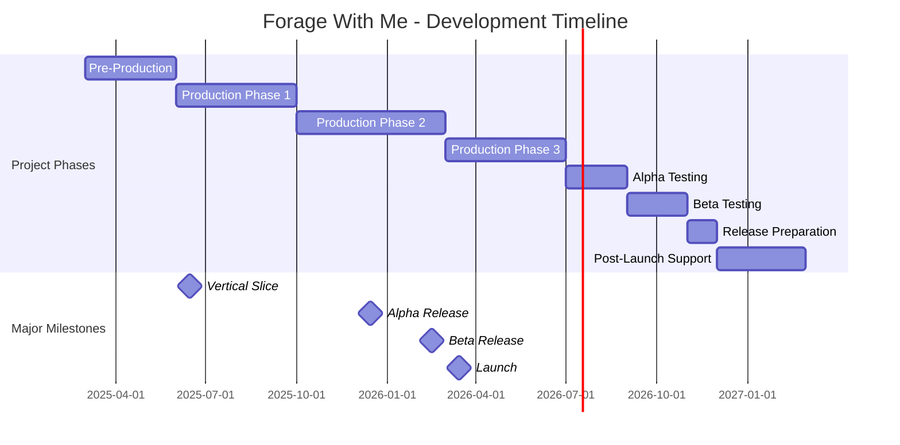
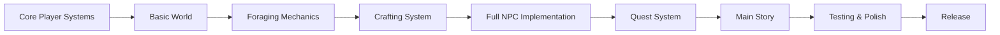

# FORAGE WITH ME
## Milestone Schedule

**Version:** 1.0  
**Last Updated:** March 4, 2025  
**Project Manager:** TBD  

---

## Table of Contents
1. [Development Timeline Overview](#development-timeline-overview)
2. [Pre-Production Phase](#pre-production-phase)
3. [Production Phase 1: Core Mechanics](#production-phase-1-core-mechanics)
4. [Production Phase 2: Content Development](#production-phase-2-content-development)
5. [Production Phase 3: Polish & Optimization](#production-phase-3-polish--optimization)
6. [Alpha & Beta Testing](#alpha--beta-testing)
7. [Release & Post-Launch](#release--post-launch)
8. [Critical Path & Dependencies](#critical-path--dependencies)
9. [Milestone Tracking](#milestone-tracking)

---

## Development Timeline Overview

### Project Timeline Summary

### 21-Month Development Plan
The complete development cycle is planned for 21 months, divided into:
- **Pre-Production:** 3 months (March 2025 - May 2025)
- **Production:** 13 months (June 2025 - June 2026)
- **Testing & Release:** 5 months (July 2026 - November 2026)

### Key Milestones

| Milestone | Target Date | Description |
|-----------|-------------|-------------|
| Project Kickoff | March 1, 2025 | Official project start, all documentation finalized |
| Gameplay Prototype | May 1, 2025 | Core mechanics functional in test environment |
| Vertical Slice | August 15, 2025 | Playable demo with one complete area |
| First Playable | November 30, 2025 | All core systems implemented |
| Content Complete | April 15, 2026 | All game content implemented |
| Alpha Release | July 1, 2026 | Feature complete, internal testing |
| Beta Release | September 1, 2026 | External testing begins |
| Release Candidate | October 15, 2026 | Final version pending critical fixes |
| Launch | November 1, 2026 | Steam release |

---

## Pre-Production Phase
*March 2025 - May 2025 (3 months)*

### Milestone 1: Project Setup (March 1-15)
- Finalize team composition and roles
- Complete all planning documents
- Set up development environment and tools
- Establish version control and project structure
- Create project schedule and communication plan

### Milestone 2: Core Systems Design (March 16-31)
- Detail technical specifications
- Create architecture diagrams
- Design database schema for game items
- Plan implementation of core systems
- Create initial class hierarchy

### Milestone 3: Art Style Development (April 1-15)
- Finalize art style guide
- Create character concepts
- Develop environment art concepts
- Design UI mockups
- Establish technical art pipeline

### Milestone 4: Gameplay Prototype (April 16 - May 15)
- Implement basic player movement
- Create simple test environment
- Build primary interaction system
- Implement inventory framework
- Develop rudimentary time system

### Pre-Production Deliverables
- Complete game design document
- Technical design document
- Art style guide and concepts
- Functional gameplay prototype
- Revised budget and schedule

### Pre-Production Exit Criteria
- Basic gameplay loop is demonstrable
- Technical approach is validated
- Visual style is approved
- Team is aligned on project vision
- Realistic scope is established

---

## Production Phase 1: Core Mechanics
*June 2025 - September 2025 (4 months)*

### Milestone 5: Player Systems (June 1-30)
- Complete player character model and animations
- Implement finalized movement system
- Develop camera control system
- Create interaction system
- Implement player stats and energy system

### Milestone 6: World Foundation (July 1-31)
- Build basic village layout
- Create player home (tier 1)
- Develop first biome (forest)
- Implement day/night cycle
- Create weather system framework

### Milestone 7: Core Gameplay Systems (August 1-31)
- Complete inventory system
- Implement basic foraging mechanics
- Create simple crafting system
- Develop initial NPC framework
- Build save/load system

### Milestone 8: Vertical Slice (September 1-30)
- Polish forest area
- Implement 3 forageable types
- Create 5 basic recipes
- Add 3 functional NPCs
- Develop UI for core systems
- Integrate sound effects and placeholder music

### Phase 1 Deliverables
- Playable vertical slice with one complete area
- Core gameplay systems functional
- Basic AI implementation
- Saving and loading working
- Initial audio implementation

### Phase 1 Exit Criteria
- Core gameplay loop is fun and engaging
- Technical foundation is solid
- Performance meets targets on minimum specs
- Art style is consistent and appealing

---

## Production Phase 2: Content Development
*October 2025 - February 2026 (5 months)*

### Milestone 9: Additional Biomes (October 1-31)
- Implement plains area
- Create river/riverside area
- Design lake area
- Add unique forageables to each area
- Implement area-specific ambient effects

### Milestone 10: Village & NPCs (November 1-30)
- Complete village design
- Implement all NPC characters
- Create dialogue system
- Develop relationship mechanics
- Add NPC schedules and routines

### Milestone 11: Foraging & Crafting Expansion (December 1-31)
- Implement all foraging minigames
- Add all forageable items
- Create complete recipe list
- Implement crafting quality system
- Add seasonal variations

### Milestone 12: Progression Systems (January 1-31)
- Implement house upgrade system
- Create tool progression
- Add skill improvement mechanics
- Develop quest/task framework
- Implement time-based events

### Milestone 13: Narrative Implementation (February 1-28)
- Add main storyline elements
- Implement all NPC dialogue
- Create seasonal festival events
- Add narrative tutorials
- Implement quest chains

### Phase 2 Deliverables
- All game areas implemented
- Complete set of NPCs with dialogue
- Full progression systems
- Main story implementation
- Quest system functional

### Phase 2 Exit Criteria
- Game is feature complete
- All mechanics are implemented
- Content framework is in place
- Game is playable from start to finish

---

## Production Phase 3: Polish & Optimization
*March 2026 - June 2026 (4 months)*

### Milestone 14: Visual Polish (March 1-31)
- Add visual effects for all interactions
- Implement advanced lighting
- Add additional animations
- Polish UI elements
- Create transition effects

### Milestone 15: Audio Implementation (April 1-30)
- Implement final music tracks
- Add comprehensive sound effects
- Create ambient sound design
- Add character vocalizations
- Implement audio mixing system

### Milestone 16: Performance Optimization (May 1-31)
- Optimize rendering pipeline
- Improve load times
- Reduce memory usage
- Fix frame rate issues
- Implement LOD system

### Milestone 17: Final Content & Bug Fixing (June 1-30)
- Final balancing of gameplay systems
- Add "quality of life" features
- Comprehensive bug fixing
- Add Easter eggs and secrets
- Implement achievements

### Phase 3 Deliverables
- Visually polished game
- Complete audio implementation
- Optimized performance
- Balanced gameplay
- Low bug count

### Phase 3 Exit Criteria
- Game runs stably on target platforms
- Frame rate meets target on minimum specs
- Game is visually polished
- Audio is complete and balanced
- All major bugs are fixed

---

## Alpha & Beta Testing
*July 2026 - October 2026 (4 months)*

### Milestone 18: Alpha Testing (July 1-31)
- Internal alpha testing
- Focused testing of specific features
- Initial controller support testing
- Performance testing across hardware configurations
- Bug identification and prioritization

### Milestone 19: Bug Fixing Sprint (August 1-31)
- Fix critical bugs identified in alpha
- Final balancing adjustments
- Polish UI and controls
- Optimize loading times
- Prepare beta build

### Milestone 20: Beta Testing (September 1-30)
- Limited external beta
- Steam beta branch setup
- Feedback collection system
- Stability testing
- Usability testing

### Milestone 21: Release Preparation (October 1-31)
- Final bug fixing
- Prepare marketing materials
- Complete Steam store page
- Prepare launch trailer
- Create day-one patch if needed

### Testing Phase Deliverables
- Comprehensive bug reports
- User feedback analysis
- Performance testing results
- Final balanced game
- Ready-to-ship build

### Testing Phase Exit Criteria
- No known critical bugs
- Game is stable on all target platforms
- User feedback has been addressed
- Performance meets or exceeds targets
- Steam store page is complete

---

## Release & Post-Launch
*November 2026 - January 2027 (3 months)*

### Milestone 22: Launch (November 1, 2026)
- Release on Steam
- Marketing push
- Community engagement
- Monitor for critical issues
- Support immediate post-launch queries

### Milestone 23: Post-Launch Support (November 15 - December 15)
- Priority bug fixes
- Community feedback collection
- Performance monitoring
- Initial sales analysis
- Patch planning

### Milestone 24: First Major Update (December 15 - January 31)
- Implement high-priority community requests
- Add quality of life improvements
- Fix non-critical bugs
- Add small content additions
- Plan future content roadmap

### Post-Launch Deliverables
- Stable product with post-launch fixes
- Community feedback report
- Sales and performance analysis
- Content roadmap
- Post-mortem report

---

## Critical Path & Dependencies

### Critical Path Items
The following elements represent the critical path for development:

### Key Dependencies

| Task | Dependencies | Risk Level |
|------|--------------|------------|
| Crafting System | Inventory System, Forageables Implementation | High |
| NPC Relationship System | Dialogue System, Gift System | Medium |
| House Upgrades | Resource Gathering, Village Implementation | Medium |
| Seasonal Changes | Time System, World Generation | High |
| Quest System | NPC Implementation, Dialogue System | Medium |

### Risk Mitigation for Dependencies
- Early prototyping of high-risk systems
- Regular integration of dependent systems
- Clear communication between team members working on connected systems
- Buffer time allocated for integration challenges

---

## Milestone Tracking

### Progress Tracking Methods
- Weekly progress reports against milestone targets
- Burndown charts for sprint completion
- Percentage-complete tracking for major features
- Risk and issue log updates

### Milestone Status Indicators
- **On Track:** Milestone is proceeding as planned
- **At Risk:** Milestone may be delayed but recovery is possible
- **Delayed:** Milestone will not meet target date, requires replanning
- **Completed:** All deliverables are done and acceptance criteria met

### Milestone Review Process
Each milestone concludes with a formal review including:
- Demo of completed features
- Review of deliverables against acceptance criteria
- Retrospective on what went well/could be improved
- Adjustment of future milestone plans if needed

### Schedule Adjustments
- Minor adjustments managed within phase buffers
- Major delays trigger formal schedule reassessment
- Scope reduction considered before extending timeline
- Team capacity always considered in any rescheduling

---

## Appendix: Milestone Checklist Templates

*Note: In the actual document, this section would include detailed checklists for each milestone to help the team track specific deliverables and requirements.*
