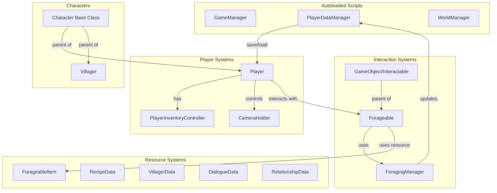
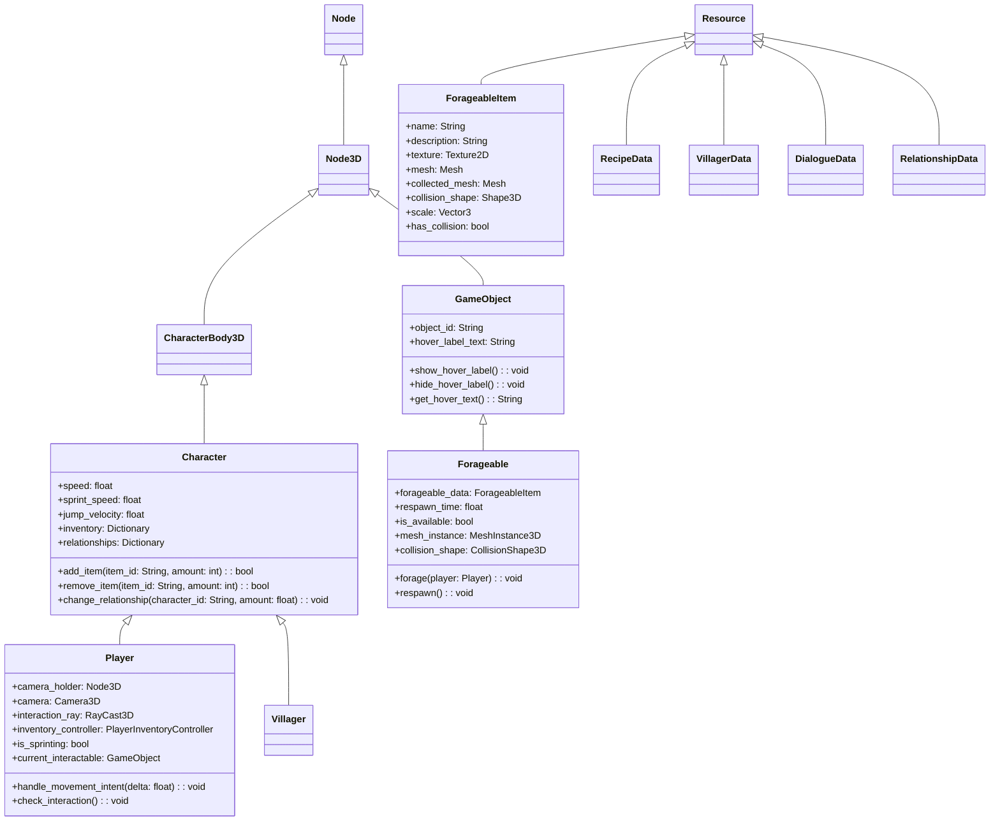
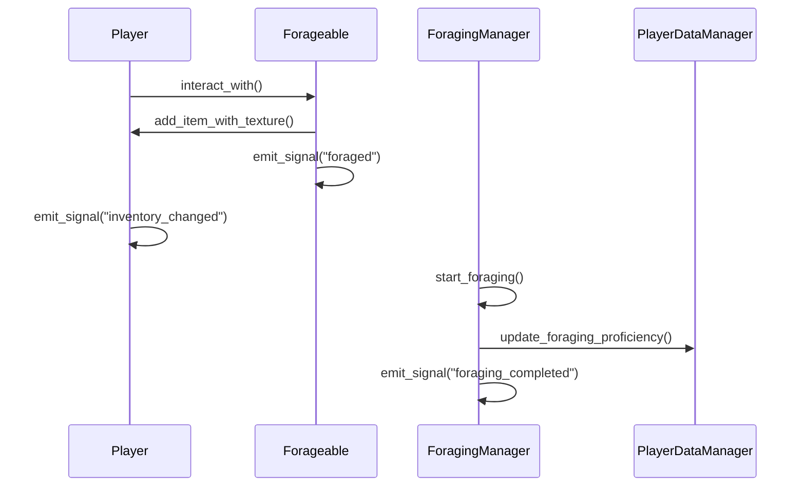
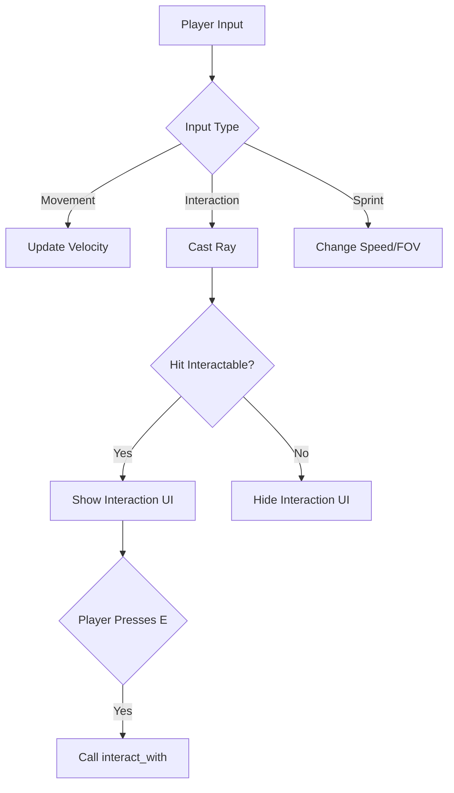
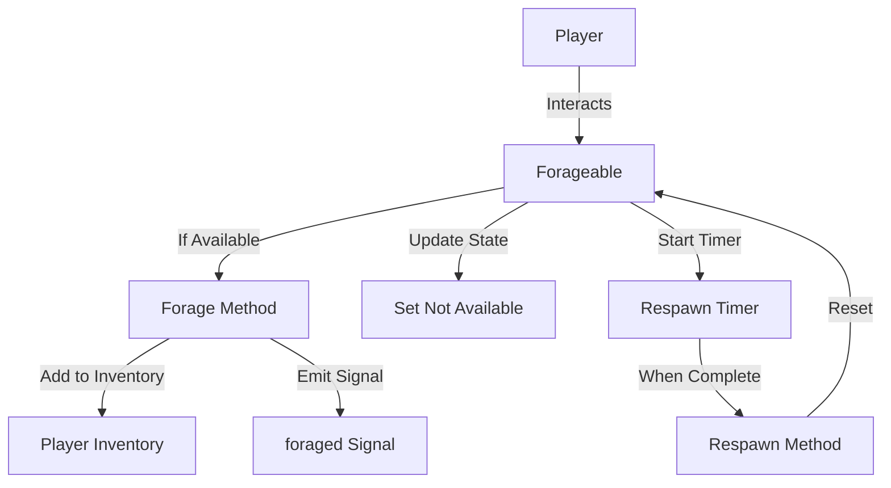
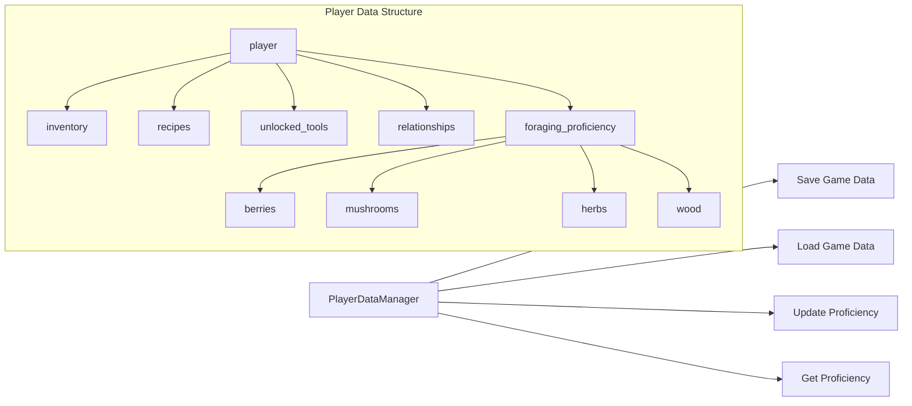
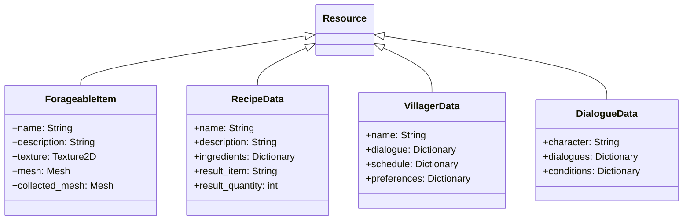

# ForageWithMe Technical Overview

## Game Architecture

This document provides a detailed technical overview of the ForageWithMe game codebase, including the script structure, signal flow, resource management, and development patterns. This guide is intended to help developers understand how the game is built and how to extend its functionality.

## Core Architecture Diagram

## Class Hierarchy

## Signal Flow Diagram

## Key Systems Breakdown

### 1. Player System

The player system is built around the `Player` class which extends from `Character`. It handles:

- Movement and controls (WASD + mouse look)
- Interaction with game objects via raycasting
- Inventory management through the `PlayerInventoryController`
- Camera control via the `CameraHolder` node

Key code paths:
- `Player.gd`: Main player logic
- `PlayerInventoryController.gd`: Handles inventory operations
- `camera_holder.gd`: Controls camera behavior, including orbit mode

### 2. Foraging System

The foraging system allows players to collect resources from the environment:

- `Forageable.gd`: Represents collectible items in the world
- `ForageableItem.gd`: Resource definition for forageable objects
- `foraging_manager.gd`: Handles foraging logic and proficiency

### 3. Data Management

The game uses several data managers to handle persistence and game state:

- `player_data_manager.gd`: Manages player data including inventory, relationships, and proficiency
- `game_manager.gd`: Handles global game settings and state
- `world_manager.gd`: Manages the game world state

## Resource System

The game uses Godot's Resource system extensively to define game data:

## Development Workflow

When adding new features to ForageWithMe, follow these patterns:

### Adding a New Forageable Item

1. Create a new ForageableItem resource in the Resources directory
2. Set up the necessary meshes and collision shapes
3. Create a new scene by instantiating the Forageable scene
4. Assign the ForageableItem resource to the forageable_data property
5. Place the scene in the world

### Adding a New NPC

1. Create a new VillagerData resource
2. Set up dialogue and schedule data
3. Instantiate the Villager scene
4. Assign the VillagerData resource
5. Add to appropriate groups and scenes

### Creating New UI Elements

1. Design UI in Godot's scene editor
2. Create a script extending from appropriate base classes
3. Connect signals from data sources
4. Implement event handlers
5. Register with appropriate managers if needed

## Performance Considerations

- The game uses instancing for repeatable elements like forageables
- Raycast-based interaction system allows for efficient collision detection
- Proficiency system uses simple float values for calculations
- Respawn timers for forageables are used to limit the number of active objects

## Next Steps for Development

1. Implement crafting system using RecipeData resources
2. Create the village and villager AI using schedules
3. Design seasonal changes for forageables
4. Implement building and customization systems
5. Add quest system with progression

## Debug Tools and Tips

- Group nodes appropriately (player, forageables, villagers, etc.)
- Use print statements with descriptive prefixes for debugging
- Test forageable interactions in isolation
- Check proficiency values through PlayerDataManager
