# ForageWithMe Script Documentation

This document provides detailed information about the scripts used in ForageWithMe, including their purpose, properties, methods, signals, and their relationships with other scripts.

## Table of Contents

1. [Autoloaded Scripts](#autoloaded-scripts)
2. [Character Scripts](#character-scripts)
3. [Interactable Scripts](#interactable-scripts)
4. [Foraging System Scripts](#foraging-system-scripts)
5. [Resource Scripts](#resource-scripts)
6. [UI Scripts](#ui-scripts)
7. [World Scripts](#world-scripts)

## Autoloaded Scripts

Autoloaded scripts are global singletons that are accessible throughout the game.

### GameManager (`game_manager.gd`)

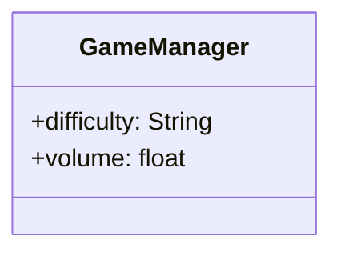

**Purpose:** Controls global game settings and state.

**Properties:**
- `difficulty`: Current game difficulty setting (default: "Normal")
- `volume`: Global game volume (default: 0.5)

**Usage:**
```gdscript
# Access the GameManager from anywhere in the game
var current_difficulty = GameManager.difficulty
```

### PlayerDataManager (`player_data_manager.gd`)

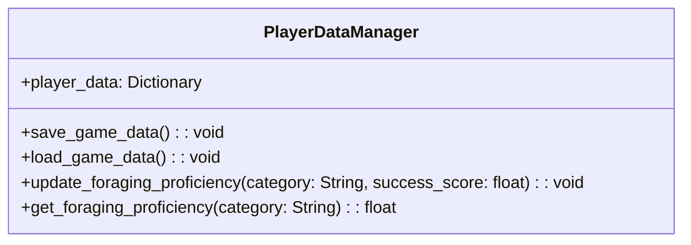

**Purpose:** Manages player data persistence, including inventory, relationships, and foraging proficiency.

**Properties:**
- `player_data`: Dictionary containing all player-related data

**Methods:**
- `save_game_data()`: Saves player data to a JSON file
- `load_game_data()`: Loads player data from a JSON file
- `update_foraging_proficiency(category, success_score)`: Updates the player's proficiency in a specific foraging category
- `get_foraging_proficiency(category)`: Returns the player's proficiency level for a specific category

**Data Structure:**
```json
{
    "player": {
        "inventory": [],
        "recipes": [],
        "unlocked_tools": [],
        "relationships": {},
        "foraging_proficiency": {
            "berries": 0.0,
            "mushrooms": 0.0,
            "herbs": 0.0,
            "wood": 0.0
        }
    },
    "villagers": {},
    "cabin": {},
    "world_state": {}
}
```

**Usage:**
```gdscript
# Save game data
PlayerDataManager.save_game_data()

# Update player's berry foraging proficiency
PlayerDataManager.update_foraging_proficiency("berries", 0.8)
```

### WorldManager (`world_manager.gd`)

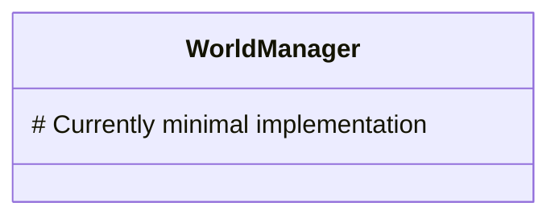

**Purpose:** Manages the game world state and areas.

## Character Scripts

### Character (`Character.gd`)

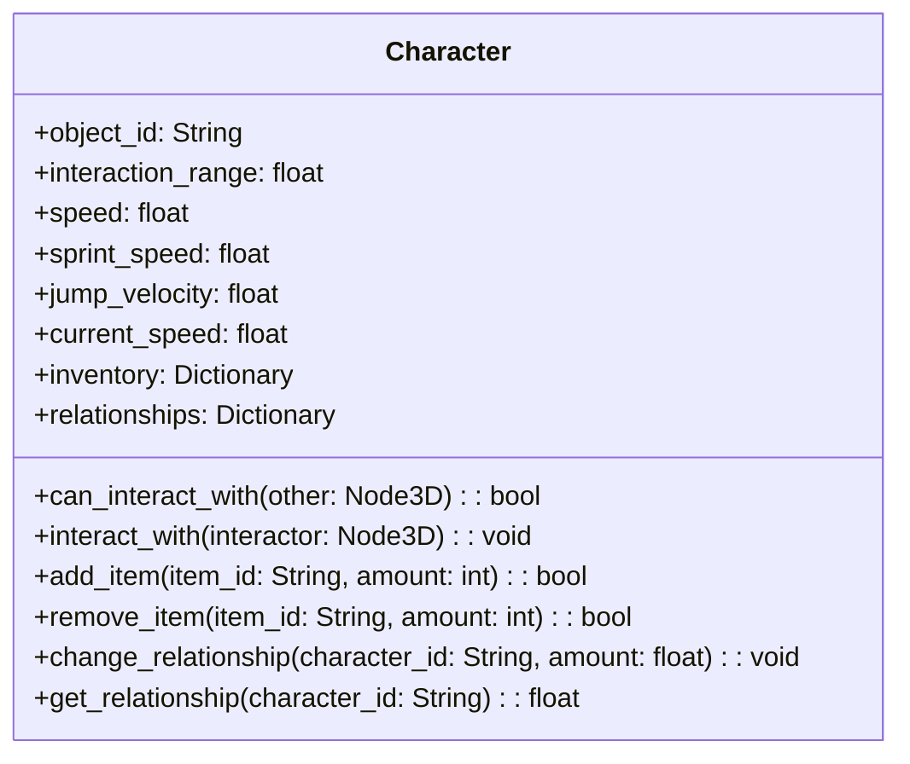

**Purpose:** Base class for all character entities (player and NPCs).

**Signals:**
- `inventory_changed`: Emitted when the character's inventory changes
- `relationship_changed`: Emitted when a relationship value changes

**Properties:**
- `object_id`: Unique identifier for the character
- `interaction_range`: Range at which the character can interact with objects
- `speed`: Normal movement speed
- `sprint_speed`: Movement speed when sprinting
- `jump_velocity`: Initial velocity when jumping
- `current_speed`: Current movement speed
- `inventory`: Dictionary of items in the character's inventory
- `relationships`: Dictionary of relationship values with other characters

**Methods:**
- `can_interact_with(other)`: Checks if another object is within interaction range
- `interact_with(interactor)`: Handles interaction with this character
- `add_item(item_id, amount)`: Adds an item to the inventory
- `remove_item(item_id, amount)`: Removes an item from the inventory
- `change_relationship(character_id, amount)`: Updates relationship value with another character
- `get_relationship(character_id)`: Gets the current relationship value with another character

### Player (`Player.gd`)

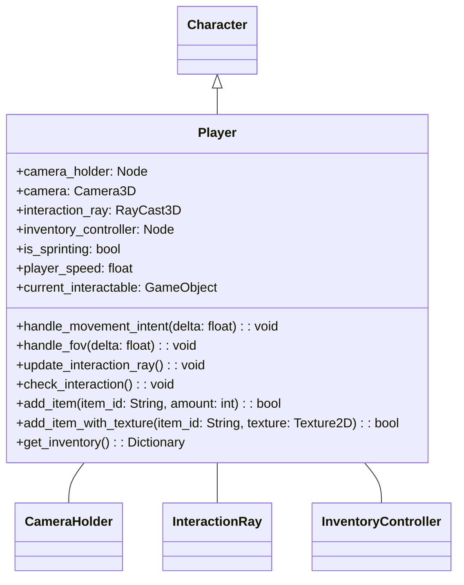

**Purpose:** Implements player-specific behavior, including movement, camera control, and interaction.

**Properties:**
- `camera_holder`: Reference to the camera holder node
- `camera`: Reference to the main camera
- `interaction_ray`: Raycast for detecting interactive objects
- `is_sprinting`: Whether the player is currently sprinting
- `player_speed`: Current player movement speed
- `current_interactable`: Reference to the currently highlighted interactable object

**Methods:**
- `handle_movement_intent(delta)`: Processes movement input and updates velocity
- `handle_fov(delta)`: Adjusts camera FOV based on movement state
- `update_interaction_ray()`: Updates the interaction raycast position and direction
- `check_interaction()`: Checks for interactable objects in front of the player
- `add_item(item_id, amount)`: Overrides base method to use inventory controller
- `add_item_with_texture(item_id, texture)`: Adds an item with a specific texture
- `get_inventory()`: Returns the current inventory

**Input Handling:**
- Mouse motion: Rotates the player
- WASD: Movement
- Shift: Sprint
- Spacebar: Jump
- E: Interact with objects

## Interactable Scripts

### GameObject (Base interactable class)

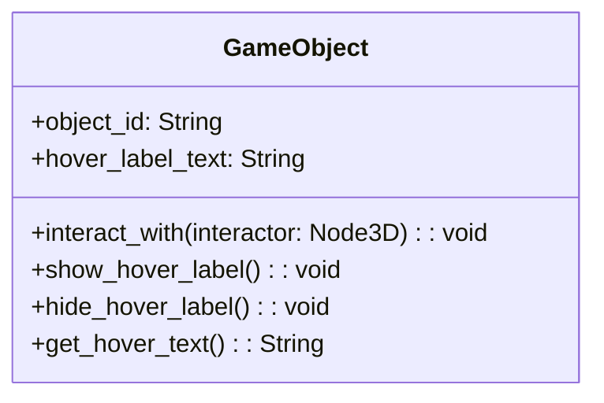

**Purpose:** Base class for interactive objects in the game world.

**Properties:**
- `object_id`: Unique identifier
- `hover_label_text`: Text to display when hovering over the object

**Methods:**
- `interact_with(interactor)`: Handles interaction with this object
- `show_hover_label()`: Shows the hover label
- `hide_hover_label()`: Hides the hover label
- `get_hover_text()`: Returns the text to display when hovering

### Forageable (`Forageable.gd`)

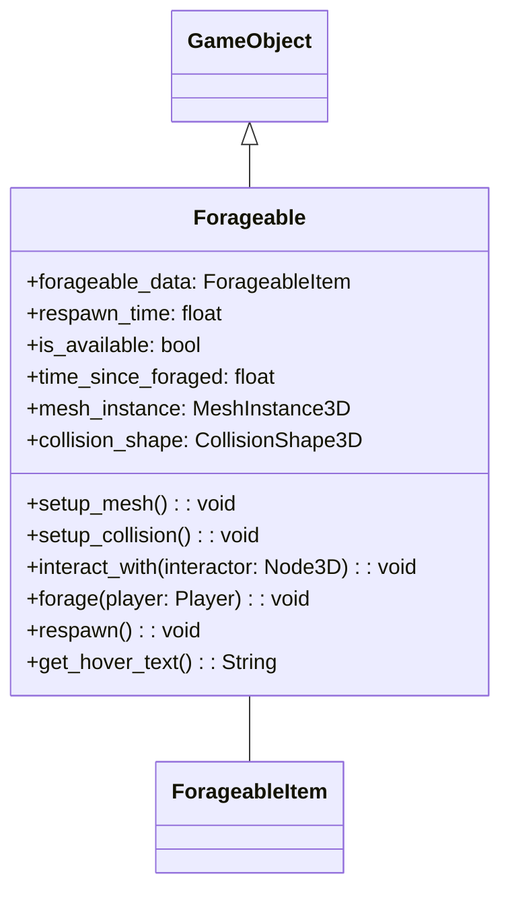

**Purpose:** Represents forageable items in the game world.

**Signals:**
- `foraged(item)`: Emitted when the item is foraged

**Properties:**
- `forageable_data`: Reference to the ForageableItem resource
- `respawn_time`: Time in seconds for the item to respawn
- `is_available`: Whether the item is currently available for foraging
- `time_since_foraged`: Time elapsed since the item was last foraged
- `mesh_instance`: Reference to the mesh instance
- `collision_shape`: Reference to the collision shape

**Methods:**
- `setup_mesh()`: Sets up the 3D mesh based on the forageable data
- `setup_collision()`: Sets up the collision shape based on the forageable data
- `interact_with(interactor)`: Handles interaction with this forageable
- `forage(player)`: Handles the foraging process
- `respawn()`: Resets the forageable to its available state
- `get_hover_text()`: Returns the hover text (empty if not available)

## Foraging System Scripts

### ForagingManager (`foraging_manager.gd`)

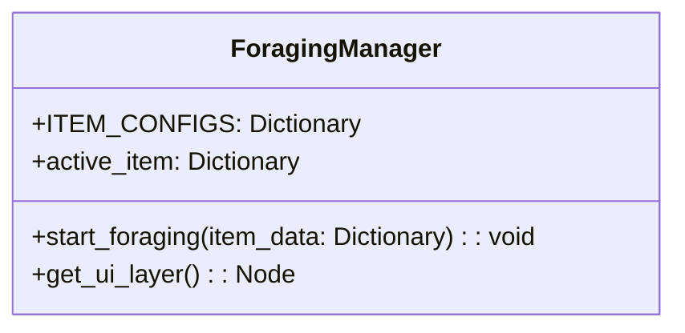

**Purpose:** Manages the foraging gameplay mechanics.

**Signals:**
- `foraging_completed(success, item_data)`: Emitted when foraging is completed

**Properties:**
- `ITEM_CONFIGS`: Configuration for different item types
- `active_item`: Currently being foraged item

**Methods:**
- `start_foraging(item_data)`: Starts the foraging process for a specific item
- `get_ui_layer()`: Gets a reference to the UI layer

**Item Configuration:**
```gdscript
const ITEM_CONFIGS = {
    "Wild Berries": {"category": "berries"},
    "Mushrooms": {"category": "mushrooms"},
    "Oak Log": {"category": "wood"}
}
```

## Resource Scripts

### ForageableItem (`forageable_item.gd`)

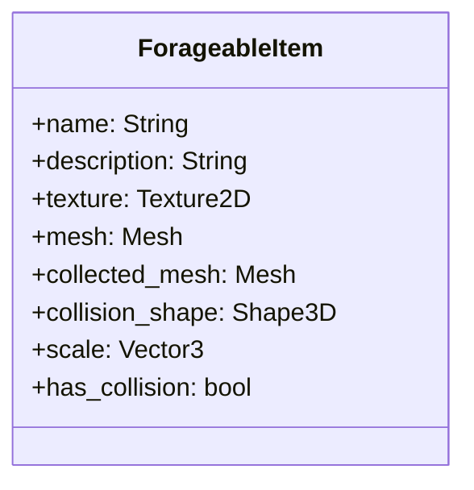

**Purpose:** Resource definition for forageable items.

**Properties:**
- `name`: Item name
- `description`: Item description
- `texture`: 2D texture for UI representation
- `mesh`: 3D mesh for world representation
- `collected_mesh`: Optional mesh for the collected state
- `collision_shape`: Collision shape for physical interaction
- `scale`: Scale of the physical object
- `has_collision`: Whether the player can walk through this forageable

## Camera System

### CameraHolder (`camera_holder.gd`)

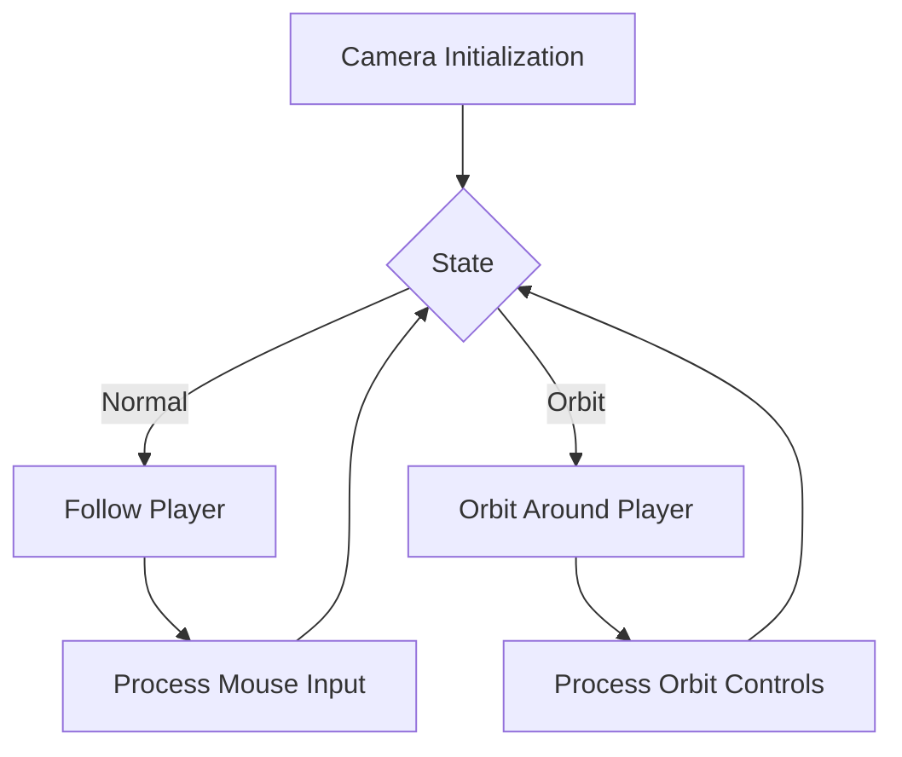

**Purpose:** Controls camera behavior, including first-person and orbit modes.

**Properties:**
- `is_orbiting`: Whether the camera is in orbit mode
- `orbit_distance`: Distance from the player in orbit mode
- `orbit_height`: Height offset in orbit mode
- `initial_player_rotation`: Stored player rotation when entering orbit mode

**Methods:**
- `_process(delta)`: Updates camera position and rotation
- `toggle_orbit_mode()`: Switches between first-person and orbit modes
- `update_orbit_position()`: Updates camera position in orbit mode

## UI Scripts

The UI system consists of several interconnected scripts that handle game interface elements. These include inventory displays, interaction prompts, and menus.

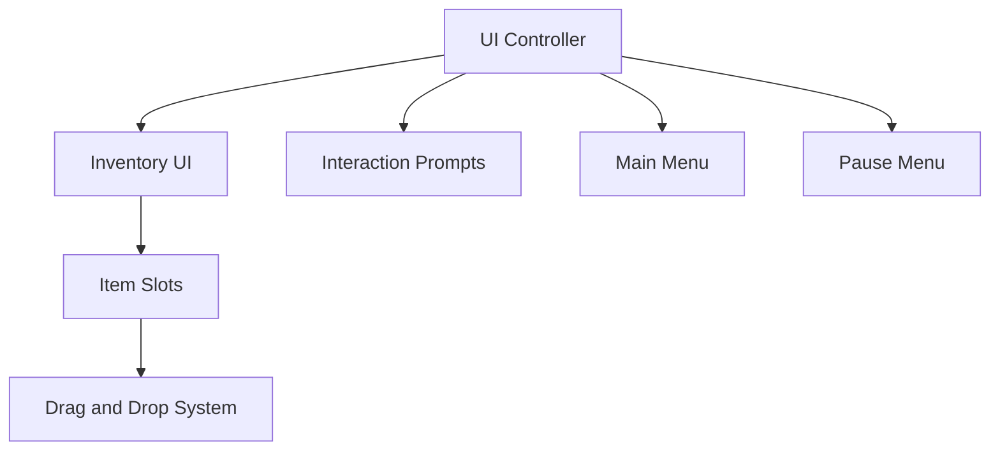

## Development Flow

When developing new features for ForageWithMe, follow this workflow:

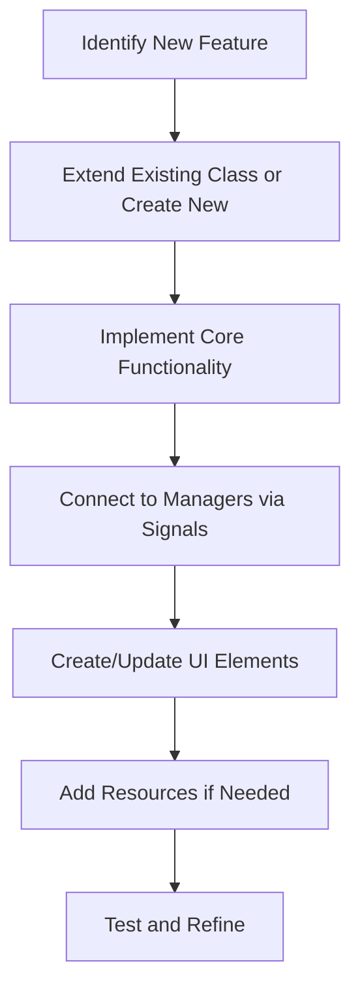

## Signal Flow Examples

### Foraging Interaction

```mermaid
sequenceDiagram
    participant Player
    participant InteractionRay
    participant Forageable
    participant ForagingManager
    participant PlayerDataManager
    participant PlayerInventory
    
    Player->>InteractionRay: Cast ray during _physics_process
    InteractionRay->>Forageable: Detect collision
    Player->>Player: Update current_interactable
    Forageable->>Forageable: Show hover label
    Player->>+Forageable: Press E to interact_with()
    Forageable->>+Player: forage()
    Player->>PlayerInventory: add_item_with_texture()
    PlayerInventory->>PlayerInventory: Update inventory dictionary
    PlayerInventory->>PlayerInventory: emit_signal("inventory_changed")
    Forageable->>Forageable: Set is_available = false
    Forageable->>Forageable: Start respawn timer
    Forageable->>-Forageable: emit_signal("foraged")
    Forageable->>-Player: Return success
```

## Adding New Forageable Items

To add a new forageable item to the game:

1. Create a new ForageableItem resource:

```gdscript
var new_forageable = ForageableItem.new()
new_forageable.name = "Red Mushroom"
new_forageable.description = "A distinctive red mushroom with white spots."
new_forageable.texture = preload("res://Images/red_mushroom.png")
new_forageable.mesh = preload("res://Assets/Mushrooms/red_mushroom.mesh")
new_forageable.collected_mesh = preload("res://Assets/Mushrooms/red_mushroom_collected.mesh")
new_forageable.has_collision = true
new_forageable.scale = Vector3(1.0, 1.0, 1.0)
ResourceSaver.save(new_forageable, "res://Resources/Forageables/red_mushroom.tres")
```

2. Create an instance of the Forageable scene:

```gdscript
var forageable_scene = preload("res://Scenes/Forageables/forageable.tscn")
var forageable_instance = forageable_scene.instantiate()
forageable_instance.forageable_data = preload("res://Resources/Forageables/red_mushroom.tres")
add_child(forageable_instance)
```

3. Update the ForagingManager ITEM_CONFIGS:

```gdscript
const ITEM_CONFIGS = {
    # Existing items...
    "Red Mushroom": {"category": "mushrooms"}
}
```

## Debugging Tips

When debugging ForageWithMe, consider these approaches:

1. Use print statements with prefixes to trace execution:
   ```gdscript
   print("PLAYER: Adding item " + item_id)
   ```

2. Monitor signals with temporary observers:
   ```gdscript
   forageable.connect("foraged", _on_forageable_foraged)
   func _on_forageable_foraged(item):
       print("SIGNAL: Item foraged: " + item.name)
   ```

3. Check player proficiency values:
   ```gdscript
   print("PROFICIENCY: Berries = " + str(PlayerDataManager.get_foraging_proficiency("berries")))
   ```

4. Verify mesh and collision setup:
   ```gdscript
   print("FORAGEABLE: Mesh valid = " + str(forageable_data.mesh != null))
   print("FORAGEABLE: Collision valid = " + str(forageable_data.collision_shape != null))
   ```
