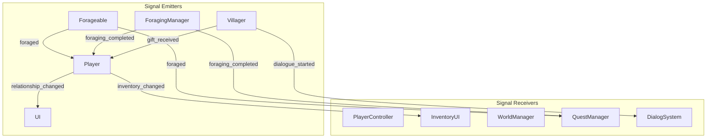
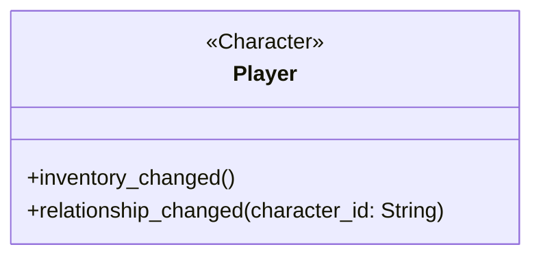
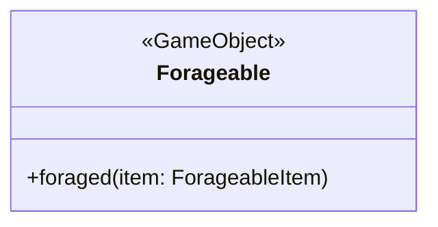
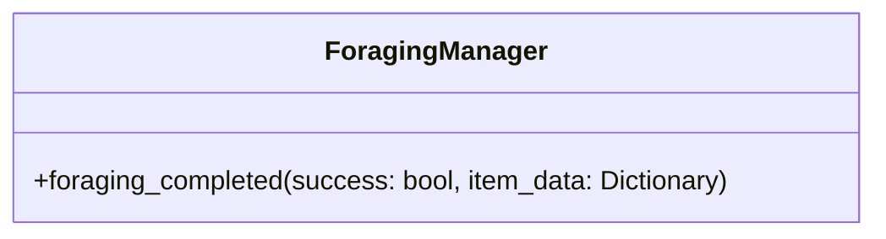
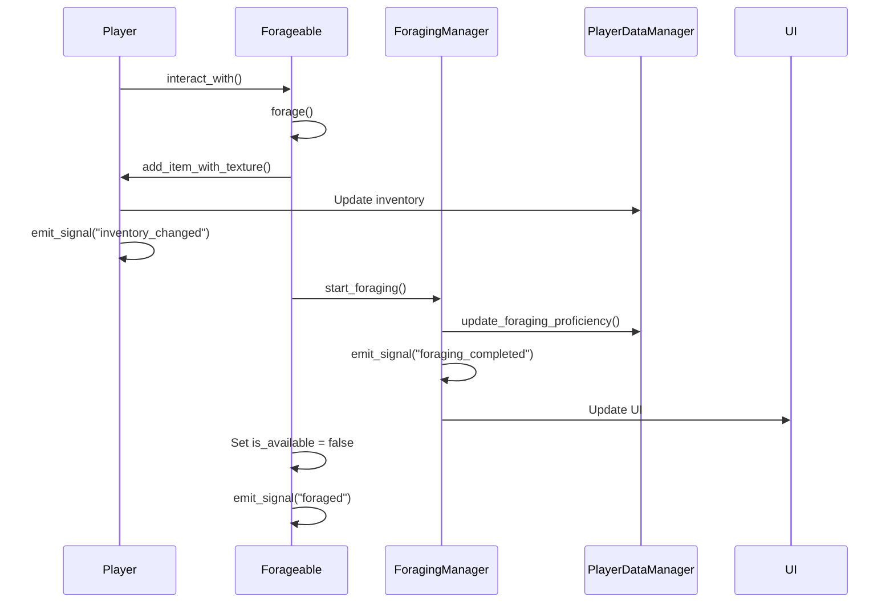
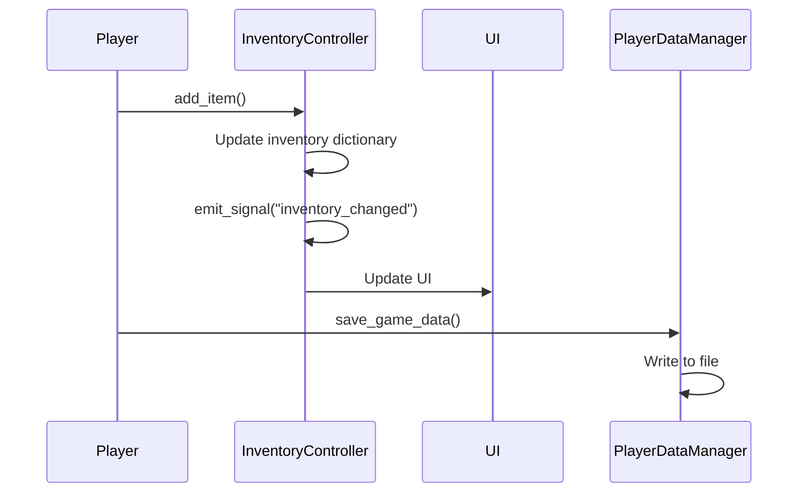
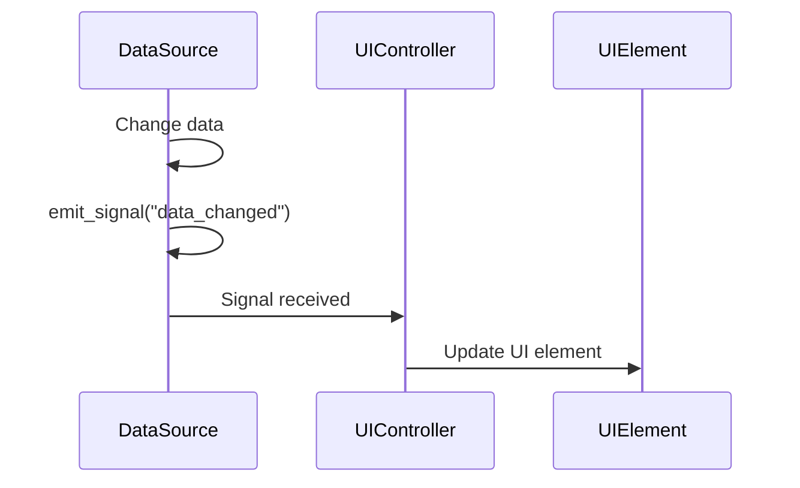
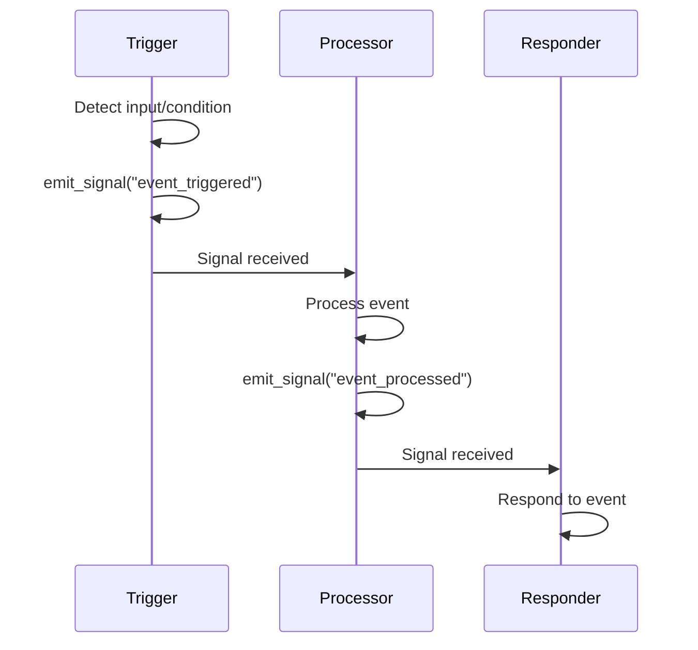
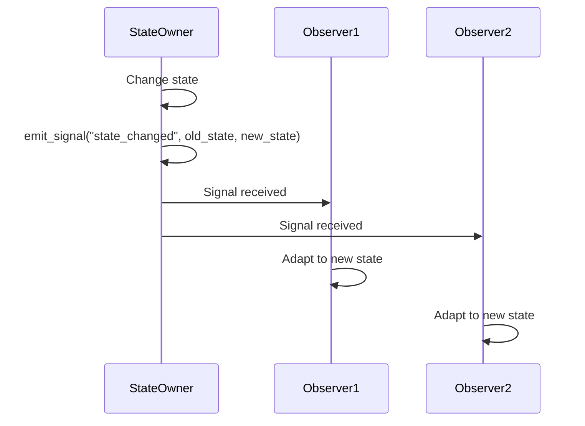

# ForageWithMe Signal System Overview

This document provides a comprehensive overview of the signal system in ForageWithMe, which is a crucial part of the game's architecture. Godot's signal system enables decoupled communication between different parts of the game, allowing for clean and maintainable code.

## Table of Contents
1. [Signal Architecture](#signal-architecture)
2. [Core Signals](#core-signals)
3. [Signal Flow Diagrams](#signal-flow-diagrams)
4. [Best Practices](#best-practices)
5. [Debugging Signals](#debugging-signals)

## Signal Architecture



## Core Signals

ForageWithMe employs several key signals to coordinate gameplay systems. Here's a breakdown of the most important signals in the game:

### Player Signals



1. **inventory_changed**
   - **Purpose**: Notifies when the player's inventory has been modified
   - **Emitted by**: Player and Character classes
   - **Connected to**: InventoryUI, QuestManager
   - **Usage**: Updates UI, checks quest completion
   
   ```gdscript
   # Emitting the signal
   emit_signal("inventory_changed")
   
   # Connecting to the signal
   player.connect("inventory_changed", Callable(inventory_ui, "_on_inventory_changed"))
   
   # Receiver implementation
   func _on_inventory_changed():
       update_inventory_display()
   ```

2. **relationship_changed**
   - **Purpose**: Notifies when a relationship value has changed
   - **Emitted by**: Character class
   - **Connected to**: UI, QuestManager
   - **Parameters**: `character_id` - ID of the character whose relationship changed
   
   ```gdscript
   # Emitting the signal
   emit_signal("relationship_changed", character_id)
   ```

### Forageable Signals



1. **foraged**
   - **Purpose**: Notifies when a forageable item has been collected
   - **Emitted by**: Forageable class
   - **Connected to**: Player, QuestManager, WorldManager
   - **Parameters**: `item` - The ForageableItem resource that was foraged
   
   ```gdscript
   # Emitting the signal
   emit_signal("foraged", forageable_data)
   
   # Connecting to the signal
   forageable.connect("foraged", Callable(quest_manager, "_on_item_foraged"))
   
   # Receiver implementation
   func _on_item_foraged(item):
       check_quest_progress(item.name)
   ```

### ForagingManager Signals



1. **foraging_completed**
   - **Purpose**: Notifies when a foraging action is complete
   - **Emitted by**: ForagingManager class
   - **Connected to**: Player, UI, QuestManager
   - **Parameters**: 
     - `success` - Whether foraging was successful
     - `item_data` - Data about the foraged item
   
   ```gdscript
   # Emitting the signal
   emit_signal("foraging_completed", success, active_item)
   
   # Connecting to the signal
   foraging_manager.connect("foraging_completed", Callable(ui_controller, "_on_foraging_completed"))
   
   # Receiver implementation
   func _on_foraging_completed(success, item_data):
       if success:
           show_success_animation(item_data)
       else:
           show_failure_animation()
   ```

## Signal Flow Diagrams

### Foraging Interaction Flow

The following diagram shows the complete signal flow when a player interacts with a forageable object:



### Inventory Management Flow



## Best Practices

When working with signals in ForageWithMe, follow these best practices:

### 1. Signal Naming

Use clear, descriptive names that indicate:
- What happened (past tense)
- What is about to happen (present tense with "ing" or "about_to")

Good examples:
- `item_collected`
- `inventory_changed`
- `about_to_save_game`

### 2. Signal Parameters

- Only pass necessary information
- Use typed parameters when possible
- Consider using dictionaries for complex data

Example:
```gdscript
signal relationship_changed(character_id: String, old_value: float, new_value: float)
```

### 3. Connection Management

- Connect signals in `_ready()` whenever possible
- Disconnect signals when nodes are removed
- Use one-shot connections for temporary observers

```gdscript
# One-shot connection
forageable.connect("foraged", Callable(self, "_on_foraged_once"), CONNECT_ONE_SHOT)
```

### 4. Emitting Signals

- Emit signals after state changes are complete
- Document what signals a class emits
- Avoid emitting the same signal multiple times in sequence

```gdscript
func collect_item():
    # Update state
    is_collected = true
    inventory.append(item_id)
    
    # Then emit signal (once)
    emit_signal("item_collected", item_id)
```

## Debugging Signals

When debugging signal-related issues in ForageWithMe, use these techniques:

### 1. Signal Connection Verification

Verify that signals are properly connected:

```gdscript
func _ready():
    var connections = forageable.get_signal_connection_list("foraged")
    print("SIGNAL: 'foraged' connections: ", connections)
```

### 2. Signal Tracing

Add temporary print statements to trace signal emissions:

```gdscript
func _on_foraged(item):
    print("SIGNAL: 'foraged' received with item: ", item.name)
```

### 3. Signal Connection Monitoring

Create a utility function to monitor signal connections:

```gdscript
func debug_signals(object):
    for signal_info in object.get_signal_list():
        var signal_name = signal_info.name
        var connections = object.get_signal_connection_list(signal_name)
        print("SIGNAL DEBUG: ", signal_name, " has ", connections.size(), " connections")
        for connection in connections:
            print("  -> Connected to: ", connection.target.name, ".", connection.method)
```

## Common Signal Patterns in ForageWithMe

### 1. UI Update Pattern



### 2. Event Chain Pattern



### 3. State Change Notification



## Extending the Signal System

When adding new features to ForageWithMe, follow these guidelines for integrating with the signal system:

1. **Identify dependencies**: Determine what other systems need to know about events in your new feature
2. **Define signals**: Create appropriate signals in your new classes
3. **Connect signals**: Connect to existing signals that your feature needs to respond to
4. **Document signals**: Update this document with new signal information
5. **Test connections**: Verify that signals are being emitted and received correctly

## Signal Overview Table

| Signal | Emitter | Receivers | Purpose |
|--------|---------|-----------|---------|
| inventory_changed | Player, Character | InventoryUI, QuestManager | Update UI and quest status when inventory changes |
| relationship_changed | Character | UI, QuestManager | Update UI and quest status when relationships change |
| foraged | Forageable | Player, QuestManager | Track collected forageables and update quests |
| foraging_completed | ForagingManager | Player, UI | Update UI after foraging attempt |
