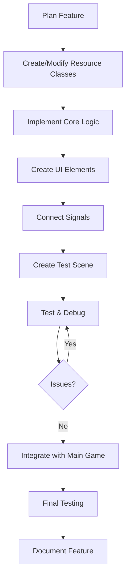
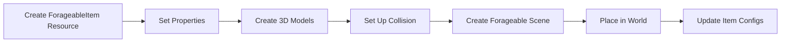
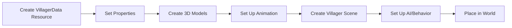
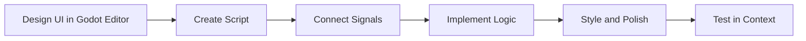
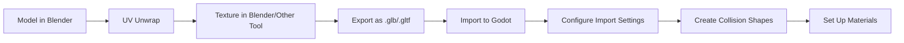
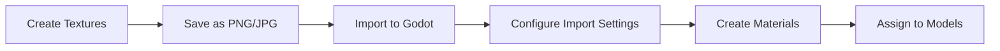

# ForageWithMe Development Workflow

This document outlines the development workflow and process for expanding the ForageWithMe game. It provides step-by-step guides for implementing new features, debugging techniques, and best practices.

## Table of Contents
1. [Development Environment Setup](#development-environment-setup)
2. [Project Structure](#project-structure)
3. [Feature Implementation Workflow](#feature-implementation-workflow)
4. [Adding New Content](#adding-new-content)
5. [Debugging Techniques](#debugging-techniques)
6. [Performance Optimization](#performance-optimization)
7. [Asset Pipeline](#asset-pipeline)

## Development Environment Setup

### Required Tools
- **Godot 4.4**: Primary game engine
- **Blender**: For 3D modeling and asset creation
- **Git**: For version control
- **Visual Studio Code**: Recommended code editor with Godot extension

### Project Setup
1. Clone the repository:
   ```bash
   git clone https://github.com/your-username/ForageWithMe.git
   ```
2. Open the project in Godot 4.4
3. Install recommended Godot plugins:
   - GDScript Formatter
   - Better 3D Editor Controls
   - Advanced Scene Dock

## Project Structure

```mermaid
graph TD
    subgraph Project Root
        A[/foragewithme]
        A --> B[/Assets]
        A --> C[/Data]
        A --> D[/Images]
        A --> E[/Resources]
        A --> F[/Scenes]
        A --> G[/Scripts]
        A --> H[project.godot]
    end
    
    subgraph Scripts Structure
        G --> G1[/Autoloaded Scripts]
        G --> G2[/Characters]
        G --> G3[/Core]
        G --> G4[/Foraging]
        G --> G5[/Interactables]
        G --> G6[/Resources]
        G --> G7[/UI]
        G --> G8[/World]
    end
    
    subgraph Scenes Structure
        F --> F1[/Characters]
        F --> F2[/Forageables]
        F --> F3[/UI]
        F --> F4[/Zones]
    end
```

### Key Directories
- **Assets**: 3D models, textures, and audio files
- **Data**: JSON and configuration files
- **Images**: 2D textures and UI elements
- **Resources**: Godot resource files (.tres)
- **Scenes**: Godot scene files (.tscn)
- **Scripts**: GDScript code files

## Feature Implementation Workflow

The general workflow for implementing new features follows these steps:



### Planning Stage
1. Define the feature's purpose and requirements
2. Identify affected systems and dependencies
3. Design the necessary classes and resources
4. Plan signal interactions

### Implementation Stage
1. Create or modify resource classes
2. Implement the core logic in appropriate script files
3. Create UI elements if needed
4. Connect signals between components
5. Create a test scene for isolated testing

### Testing Stage
1. Test the feature in isolation
2. Debug any issues
3. Integrate with the main game
4. Test in the context of the full game
5. Document the new feature

## Adding New Content

### Adding a New Forageable Item



#### Step-by-Step Guide

1. **Create a new ForageableItem resource**:
   - Right-click in the Resources folder
   - Select "New Resource"
   - Choose "ForageableItem"
   - Save as `new_item_name.tres`

2. **Set up the ForageableItem properties**:
   ```gdscript
   # Properties to set in the Inspector
   name = "Wild Blueberries"
   description = "Sweet, wild blueberries that grow in forested areas."
   texture = [Select texture file]
   mesh = [Select mesh file]
   collected_mesh = [Optional: Select collected state mesh]
   collision_shape = [Create or select collision shape]
   scale = Vector3(1.0, 1.0, 1.0)
   has_collision = true  # Set to false if player should walk through it
   ```

3. **Create a new Forageable scene instance**:
   - Right-click in the Scene panel
   - Select "Instance Child Scene"
   - Choose the base Forageable scene
   - Assign your new ForageableItem resource to the `forageable_data` property

4. **Place in the world**:
   - Position the Forageable instance in your game world
   - Adjust transform as needed

5. **Update ForagingManager's ITEM_CONFIGS**:
   ```gdscript
   # In foraging_manager.gd
   const ITEM_CONFIGS = {
       # Existing items...
       "Wild Blueberries": {"category": "berries"}
   }
   ```

### Adding a New Character



#### Step-by-Step Guide

1. **Create a new VillagerData resource**:
   - Right-click in the Resources folder
   - Select "New Resource"
   - Choose "VillagerData"
   - Save as `villager_name.tres`

2. **Set up the VillagerData properties**:
   ```gdscript
   # Properties to set in the Inspector
   name = "Emma"
   dialogue = {
       "greeting": ["Hello there!", "Lovely day, isn't it?"],
       "farewell": ["See you later!", "Take care!"]
   }
   schedule = {
       "morning": {"location": "farm", "activity": "working"},
       "afternoon": {"location": "village", "activity": "shopping"},
       "evening": {"location": "home", "activity": "relaxing"}
   }
   preferences = {
       "liked_items": ["Wild Berries", "Mushrooms"],
       "disliked_items": ["Oak Log"]
   }
   ```

3. **Create a new Villager scene instance**:
   - Right-click in the Scene panel
   - Select "Instance Child Scene"
   - Choose the base Villager scene
   - Assign your new VillagerData resource to the `villager_data` property

4. **Set up animations and behavior**:
   - Configure the AnimationPlayer with appropriate animations
   - Set up the AIController properties
   - Configure interaction dialogue

5. **Place in the world**:
   - Position the Villager instance in your game world
   - Set up navigation path points if needed

### Creating a New UI Element



#### Step-by-Step Guide

1. **Design the UI in Godot's editor**:
   - Create a new scene with a Control or CanvasLayer root
   - Add appropriate UI nodes (Labels, Buttons, TextureRects, etc.)
   - Set up the layout using containers

2. **Create a script for the UI element**:
   ```gdscript
   extends Control
   # or extends CanvasLayer, PanelContainer, etc.

   signal ui_closed
   signal action_performed(action_data)

   func _ready():
       # Initial setup
       setup_connections()

   func setup_connections():
       # Connect button signals, etc.
       $Button.connect("pressed", Callable(self, "_on_button_pressed"))
       if PlayerDataManager:  # Check for autoloaded script
           PlayerDataManager.connect("inventory_changed", Callable(self, "update_display"))

   func update_display():
       # Update UI based on current game state
       pass

   func _on_button_pressed():
       # Handle button press
       emit_signal("action_performed", {"action": "button_pressed"})
   ```

3. **Connect to game systems**:
   - Connect to relevant signals from game managers
   - Register with appropriate UI controllers

4. **Test in context**:
   - Add the UI element to a test scene
   - Verify that it responds correctly to interactions
   - Check for proper styling and layout in different resolutions

## Debugging Techniques

### Console Logging

Use print statements with tags to help filter output:

```gdscript
print("FORAGE: Player attempting to forage item: " + item_name)
print("INVENTORY: Adding item " + item_id + " x" + str(amount))
print("UI: Updating display for item " + item_name)
```

### Visual Debugging

Godot's built-in tools for visual debugging:

1. **RayCast visualization**:
   ```gdscript
   interaction_ray.debug_shape_custom_color = Color.BLUE
   interaction_ray.debug_shape_thickness = 2
   ```

2. **Draw debug shapes**:
   ```gdscript
   func _draw():
       draw_circle(Vector2(100, 100), 50, Color.RED)
       draw_line(Vector2(0, 0), Vector2(200, 200), Color.GREEN, 2)
   ```

3. **Scene tree exploration**:
   - Use `get_tree().get_nodes_in_group("player")` to find specific nodes
   - Print node path information: `print("Node path: ", node.get_path())`

### Common Issues and Solutions

#### Signal Connection Issues

Problem: Signals not being received by target objects.

Solution:
1. Verify signal is properly defined:
   ```gdscript
   signal my_signal(parameter)
   ```

2. Check connection:
   ```gdscript
   if !is_connected("my_signal", target, "_on_my_signal"):
       connect("my_signal", Callable(target, "_on_my_signal"))
   ```

3. Verify signal is being emitted:
   ```gdscript
   print("SIGNAL: About to emit my_signal with param: ", parameter)
   emit_signal("my_signal", parameter)
   print("SIGNAL: Emitted my_signal")
   ```

#### Resource Loading Issues

Problem: Resources not loading properly.

Solution:
1. Check path validity:
   ```gdscript
   var res_path = "res://Resources/Forageables/berry.tres"
   if ResourceLoader.exists(res_path):
       print("RESOURCE: Path is valid: " + res_path)
   else:
       print("RESOURCE ERROR: Invalid path: " + res_path)
   ```

2. Try different loading approaches:
   ```gdscript
   # Method 1: preload (compile-time)
   var resource = preload("res://Resources/Forageables/berry.tres")
   
   # Method 2: load (run-time)
   var resource = load("res://Resources/Forageables/berry.tres")
   
   # Method 3: ResourceLoader
   var resource = ResourceLoader.load("res://Resources/Forageables/berry.tres")
   ```

## Performance Optimization

### Object Pooling

For frequently instantiated objects like forageables:

```gdscript
class_name ForageablePool

var pool = []
var forageable_scene = preload("res://Scenes/Forageables/forageable.tscn")
var pool_size = 20

func _init():
    # Pre-instantiate objects
    for i in range(pool_size):
        var obj = forageable_scene.instantiate()
        obj.set_process(false)
        obj.visible = false
        pool.append(obj)

func get_forageable():
    # Find an available object in the pool
    for obj in pool:
        if !obj.visible:
            obj.visible = true
            obj.set_process(true)
            return obj
    
    # If no objects available, create a new one
    var obj = forageable_scene.instantiate()
    pool.append(obj)
    return obj

func return_to_pool(obj):
    obj.visible = false
    obj.set_process(false)
```

### LOD (Level of Detail) System

For distant objects:

```gdscript
func update_lod():
    var distance_to_player = global_position.distance_to(player.global_position)
    
    if distance_to_player > 50.0:
        # Low detail
        mesh_instance.mesh = low_detail_mesh
        collision_shape.disabled = true
    elif distance_to_player > 20.0:
        # Medium detail
        mesh_instance.mesh = medium_detail_mesh
        collision_shape.disabled = false
    else:
        # High detail
        mesh_instance.mesh = high_detail_mesh
        collision_shape.disabled = false
```

## Asset Pipeline

### 3D Model Workflow



#### Recommended Export Settings from Blender

- Format: glTF 2.0 (.glb/.gltf)
- Include:
  - Selected Objects
  - Custom Properties
  - Cameras
  - Punctual Lights
- Transform:
  - +Y Up
- Geometry:
  - Apply Modifiers
  - UVs
  - Normals
  - Tangents
  - Vertex Colors
  - Materials
  - Textures

### Texture Workflow



#### Recommended Texture Settings

- Format: PNG for transparency, JPG for opaque
- Size: Power of 2 (256x256, 512x512, etc.)
- Compression: Lossy or Lossless based on needs
- Filter: Linear for most textures, Nearest for pixel art
- Repeat: Enable for tiling textures
- MipMaps: Enable for distant objects

## Conclusion

This development workflow document provides a foundation for expanding the ForageWithMe game. By following these guidelines, you can ensure consistent, high-quality implementation of new features while maintaining good performance and code organization.

Remember to:
1. Plan features before implementation
2. Follow the established patterns in the existing codebase
3. Use appropriate debugging techniques
4. Optimize for performance when necessary
5. Document your changes

### Next Development Priorities

1. Expand the foraging system with seasonal variety
2. Implement crafting mechanics
3. Develop villager AI and schedules
4. Create quest system
5. Add building and customization features
