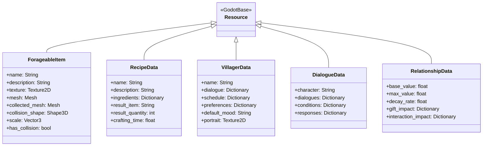
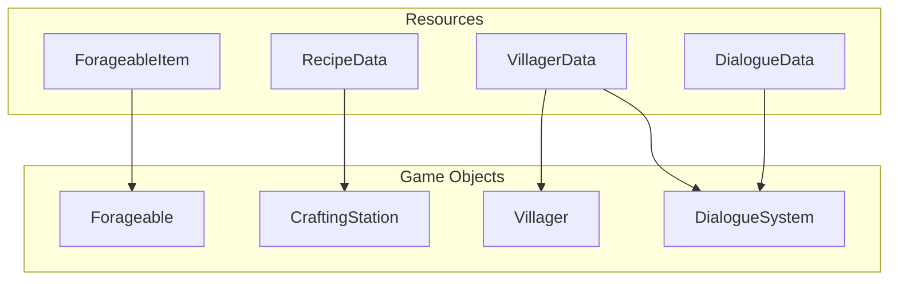
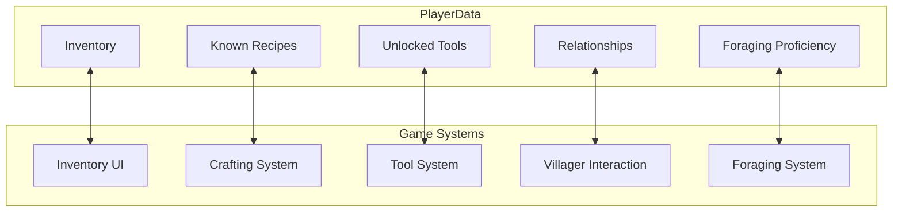
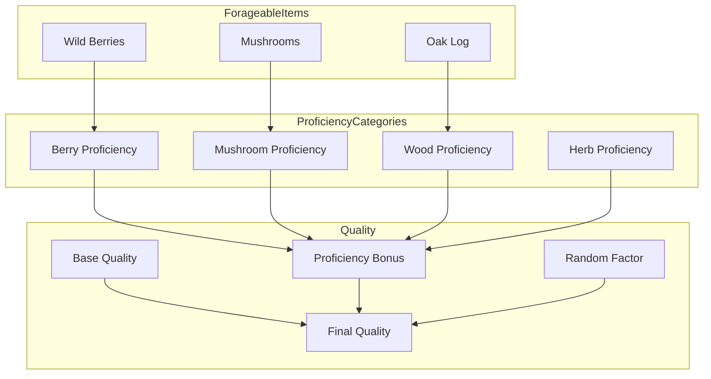
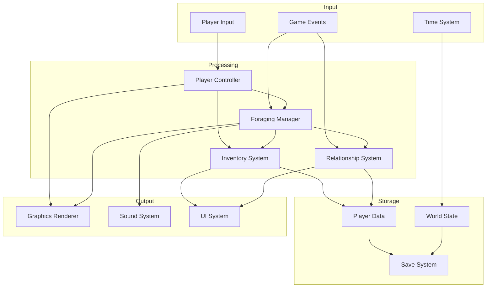
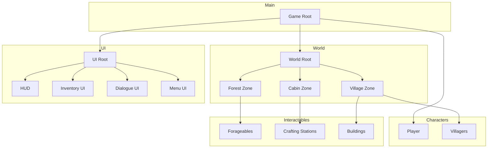
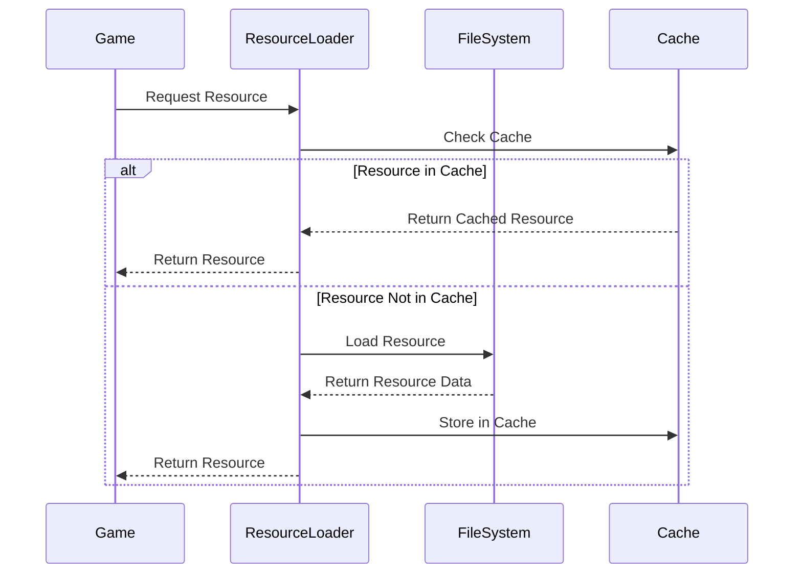
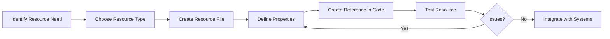
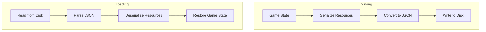
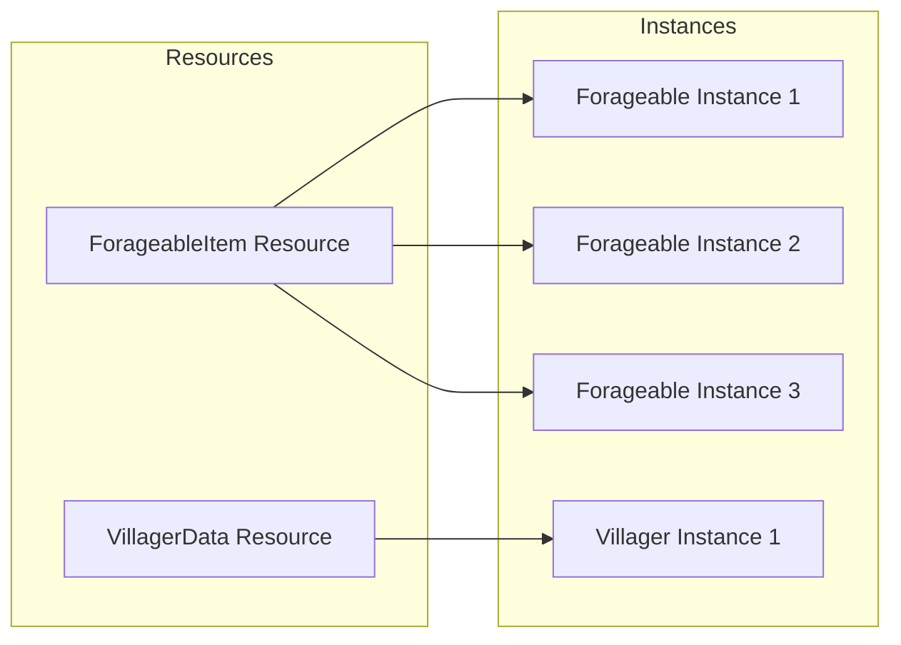

# ForageWithMe Resource Relationships

This document provides a visual overview of the relationships between different resources in the ForageWithMe game. These diagrams are designed specifically for Obsidian's Mermaid support and help illustrate how the various game systems are interconnected.

## Core Resource Types



## Resource Usage in Game Systems



## Player Data Relationships



## Foraging System Details



## Data Flow in ForageWithMe



## Scene Architecture



## Resource Loading Flow



## Creating New Resources

When creating new resources for ForageWithMe, follow this workflow:



## Resource Templates

Here are examples of properly configured resources for reference:

### ForageableItem Example

```gdscript
# Wild Berries (ForageableItem)
name = "Wild Berries"
description = "Sweet, wild berries that grow in forested areas."
texture = [Texture2D: berries.png]
mesh = [Mesh: berries.mesh]
collected_mesh = [Mesh: berries_collected.mesh]
collision_shape = [SphereShape3D: r=0.5]
scale = Vector3(1.0, 1.0, 1.0)
has_collision = false
```

### RecipeData Example

```gdscript
# Berry Jam (RecipeData)
name = "Berry Jam"
description = "A sweet jam made from wild berries."
ingredients = {
    "Wild Berries": 3,
    "Sugar": 1
}
result_item = "Berry Jam"
result_quantity = 1
crafting_time = 5.0
```

### VillagerData Example

```gdscript
# Emma (VillagerData)
name = "Emma"
dialogue = {
    "greeting": [
        "Hello there! Lovely day, isn't it?",
        "Oh, hello! Nice to see you today."
    ],
    "farewell": [
        "Take care now!",
        "See you around!"
    ]
}
schedule = {
    "morning": {"location": "farm", "activity": "working"},
    "afternoon": {"location": "village", "activity": "shopping"},
    "evening": {"location": "home", "activity": "relaxing"}
}
preferences = {
    "liked_items": ["Wild Berries", "Berry Jam"],
    "disliked_items": ["Oak Log"]
}
default_mood = "happy"
portrait = [Texture2D: emma_portrait.png]
```

## Resource Saving and Loading

The diagram below illustrates how resources are saved and loaded in ForageWithMe:



## Resource Instances

This diagram shows how resource instances are used in the game world:


