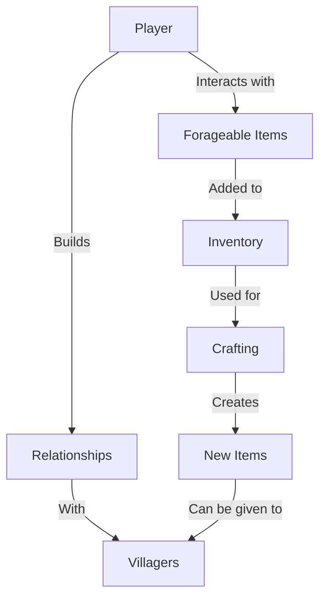

# ForageWithMe: Project Overview for Beginners

This guide provides a simple explanation of how the ForageWithMe game is structured, without using complicated programming terms. It's perfect for anyone curious about how the game works, even if you don't have a background in game development.

## Table of Contents
1. [What Makes Up the Game?](#what-makes-up-the-game)
2. [Main Game Systems](#main-game-systems)
3. [How the Player Character Works](#how-the-player-character-works) 
4. [The Foraging System](#the-foraging-system)
5. [Game World and Items](#game-world-and-items)
6. [Visual Guide to the Game Structure](#visual-guide-to-the-game-structure)
7. [Glossary of Terms](#glossary-of-terms)

## What Makes Up the Game?

ForageWithMe is like a digital dollhouse with many different parts working together. Here's a simple breakdown:

- **The Engine**: Godot 4.4 is like the foundation of a house - it provides the basic building blocks
- **Scenes**: These are like rooms in a house - separate areas that serve different purposes
- **Scripts**: These are like instruction manuals that tell each part of the game what to do
- **Resources**: These are like furniture and decorations - they define how things look and behave

## Main Game Systems

ForageWithMe has several main systems that work together:

### Player System
Controls everything related to the player character:
- Movement and camera controls
- Inventory management
- Interaction with objects in the world

### Foraging System
Handles collecting resources from the environment:
- Finding items in the world
- Gathering them when you interact
- Tracking your skill level with different types of foraging

### Inventory System
Keeps track of what you've collected:
- Storing items you gather
- Organizing different types of items
- Showing what you have in the user interface

### World System
Manages the game environment:
- Different areas like forests and villages
- Time of day and weather
- Respawning forageable items over time

## How the Player Character Works

The player character in ForageWithMe is controlled using:

- **WASD keys**: For moving around
- **Mouse**: For looking around
- **E key**: For interacting with things in the world

When you approach something you can interact with:
1. A special invisible ray extends from your character to detect items
2. If it hits something interactive, a label appears
3. When you press E, your character performs the appropriate action
4. For forageables, the item is collected and added to your inventory

## The Foraging System

The foraging system is at the heart of the game:

1. **Finding Resources**: Forageable items are scattered throughout the world
2. **Collecting**: When you interact with a forageable, it's added to your inventory
3. **Proficiency**: The more you collect a certain type of item, the better you get at finding it
4. **Respawning**: After collection, items will regrow or reappear after some time
5. **Seasons**: Different items may be available based on the in-game season

## Game World and Items

The world of ForageWithMe contains:

- **Forest Areas**: Rich with wild berries, mushrooms, and wood
- **Village**: Where NPCs (non-player characters) live and work
- **Your Cabin**: A home base where you can craft and store items

Items you can collect include:
- Wild Berries
- Mushrooms
- Oak Logs
- Herbs
- And many more to discover!

## Visual Guide to the Game Structure

```
PLAYER
  │
  ├── Controls Movement
  │     └── WASD keys and Mouse
  │
  ├── Interacts With World
  │     └── E key to interact
  │
  ├── Has Inventory
  │     ├── Berries
  │     ├── Mushrooms
  │     ├── Wood
  │     └── Other items...
  │
  └── Has Skills
        └── Foraging Proficiency
              ├── Berries
              ├── Mushrooms
              ├── Wood
              └── Herbs
```

```
WORLD
  │
  ├── Forest Zone
  │     └── Contains Forageables
  │           ├── Berries
  │           ├── Mushrooms
  │           └── Trees
  │
  ├── Village Zone
  │     └── Contains Villagers
  │           └── Have Relationships
  │                 └── Changes with interactions
  │
  └── Cabin Zone
        └── Contains
              ├── Storage
              └── Crafting
```

## How Things Connect



## Behind the Scenes

When you play ForageWithMe, here's what happens behind the scenes:

1. **Starting the Game**:
   - Godot engine loads all the game files
   - Game managers set up the initial state
   - The world is populated with items and characters

2. **Playing the Game**:
   - The game runs a continuous loop checking for player input
   - When you press keys, the player character responds
   - The game constantly updates things like time of day and item respawning

3. **Saving Progress**:
   - Your inventory, relationships, and progress are saved to a file
   - This file is loaded when you start the game again

## Glossary of Terms

Here are some terms you might encounter when looking at the game files:

- **Scene**: A specific setup of objects in the game (like a level or menu)
- **Node**: A single object in the game (like the player or a tree)
- **Script**: Instructions that tell nodes how to behave
- **Resource**: Data that defines properties of game elements
- **Signal**: A way for different parts of the game to communicate with each other
- **Autoload**: Scripts that are always available throughout the game
- **Mesh**: The 3D model of an object
- **Texture**: The 2D image that covers a 3D model
- **Collision**: What determines when objects bump into each other

## The Magic of Game Development

Games like ForageWithMe might seem complicated, but they're built one piece at a time. Each part has a specific job, and when they all work together, they create an immersive world for you to explore.

Even if you don't understand all the technical details, you can appreciate the creativity and design that goes into making a game. And if you're curious to learn more, Godot is a free and beginner-friendly game engine that's perfect for starting your own game development journey!
