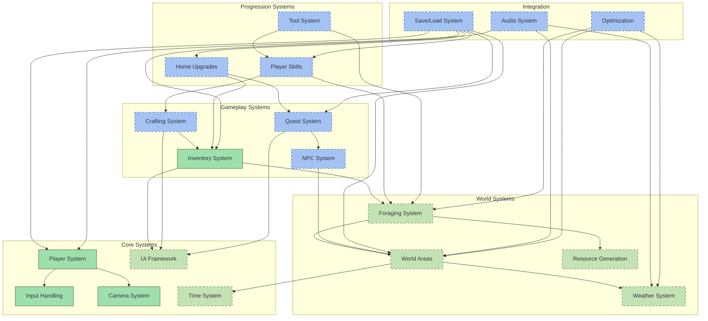
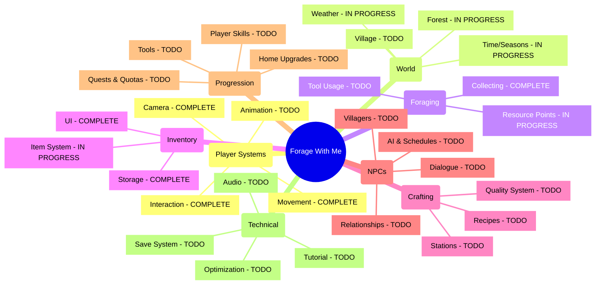

# Forage With Me - Project Visualization

This document provides a visual overview of the project components, their relationships, and completion status.

## Color Legend
- **Green** = Completed
- **Blue** = In Progress / To Be Done

## System Architecture Overview

```mermaid
graph TD
    classDef complete fill:#9de0ad,stroke:#4b5320,color:#333
    classDef inProgress fill:#a4c2f4,stroke:#0b5394,color:#333
    classDef todo fill:#a4c2f4,stroke:#0b5394,color:#333,stroke-dasharray: 5 5

    %% Core Systems
    Core["Core Systems"] --> CoreSubA
    Core --> CoreSubB
    Core --> CoreSubC
    
    %% Core Systems - A
    CoreSubA["Character Systems"]
    CoreSubA --> PlayerCore["Player Character Setup"] 
    CoreSubA --> PlayerMovement["Player Movement"] 
    CoreSubA --> Camera["Camera Controller"] 
    CoreSubA --> Animation["Animation State Machine"]
    CoreSubA --> Interaction["Interaction System"]
    
    %% Core Systems - B
    CoreSubB["Time & Season"]
    CoreSubB --> TimeCore["Time System Core"]
    CoreSubB --> SeasonCore["Season System"]
    
    %% Core Systems - C
    CoreSubC["UI Framework"]
    CoreSubC --> HUD["HUD Elements"]
    CoreSubC --> MenuFramework["Menu Framework"]
    CoreSubC --> InvUI["Inventory UI"]
    
    %% World & Environment
    World["World & Environment"] --> WorldSubA
    World --> WorldSubB
    
    %% World Systems - A
    WorldSubA["Level Design"]
    WorldSubA --> Village["Village Hub"]
    WorldSubA --> PlayerHouse["Player House"]
    WorldSubA --> ForestArea["Forest Area"]
    
    %% World Systems - B
    WorldSubB["Environment Systems"]
    WorldSubB --> ForagePoints["Foraging Points System"]
    WorldSubB --> Weather["Weather System"]
    WorldSubB --> WeatherVFX["Weather Visual Effects"]
    
    %% Gameplay Systems
    Gameplay["Gameplay Systems"] --> GameplaySubA
    Gameplay --> GameplaySubB
    Gameplay --> GameplaySubC
    
    %% Gameplay - A
    GameplaySubA["Item Systems"]
    GameplaySubA --> InvController["Inventory Controller"]
    GameplaySubA --> ItemResources["Item Resources"]
    GameplaySubA --> ForageMechanics["Foraging Mechanics"]
    
    %% Gameplay - B
    GameplaySubB["Crafting"]
    GameplaySubB --> CraftStations["Crafting Stations"]
    GameplaySubB --> RecipeSystem["Recipe System"]
    GameplaySubB --> CraftingUI["Crafting UI"]
    
    %% Gameplay - C
    GameplaySubC["NPC Systems"]
    GameplaySubC --> NPCCore["NPC Setup"]
    GameplaySubC --> NPCAI["NPC AI Controller"]
    GameplaySubC --> Dialogue["Dialogue System"]
    
    %% Progression Systems
    Progression["Progression Systems"] --> ProgressionSubA
    Progression --> ProgressionSubB
    
    %% Progression - A
    ProgressionSubA["Player Home"]
    ProgressionSubA --> HomeTier1["Home Tier 1"]
    ProgressionSubA --> HomeUpgrade["Home Upgrade System"]
    ProgressionSubA --> HomeTier2["Home Tier 2"]
    
    %% Progression - B
    ProgressionSubB["Quest & Skills"]
    ProgressionSubB --> QuotaManager["Quota Manager System"]
    ProgressionSubB --> QuestCore["Quest System Core"]
    ProgressionSubB --> QuestUI["Quest UI"]
    ProgressionSubB --> PlayerSkills["Player Skills Framework"]
    ProgressionSubB --> ToolSystem["Tool System"]
    
    %% Polish & Integration
    Polish["Polish & Integration"] --> PolishSubA
    Polish --> PolishSubB
    Polish --> PolishSubC
    
    %% Polish - A
    PolishSubA["Save System"]
    PolishSubA --> SaveStructure["Save Data Structure"]
    PolishSubA --> SaveImplementation["Save/Load Implementation"]
    
    %% Polish - B
    PolishSubB["Audio"]
    PolishSubB --> AudioManager["Audio Manager"]
    PolishSubB --> AmbientSounds["Ambient Sound System"]
    PolishSubB --> ActionSounds["Action Sounds"]
    
    %% Polish - C
    PolishSubC["Optimization"]
    PolishSubC --> ObjectPooling["Object Pooling System"]
    PolishSubC --> LODSystem["Level of Detail System"]
    PolishSubC --> MemOpt["Memory Optimization"]
    PolishSubC --> TutorialSystem["Tutorial System"]
    
    %% Assign classes
    %% Complete items
    class PlayerCore,PlayerMovement,Camera,Interaction,InvController,InvUI,ForageMechanics complete
    
    %% Partial/In Progress items
    class TimeCore,ForestArea,ForagePoints,ItemResources,HUD,Weather complete
    
    %% Todo items
    class Animation,SeasonCore,MenuFramework,Village,PlayerHouse,WeatherVFX,CraftStations,RecipeSystem,CraftingUI,NPCCore,NPCAI,Dialogue,HomeTier1,HomeUpgrade,HomeTier2,QuotaManager,QuestCore,QuestUI,PlayerSkills,ToolSystem,SaveStructure,SaveImplementation,AudioManager,AmbientSounds,ActionSounds,ObjectPooling,LODSystem,MemOpt,TutorialSystem todo
```

## Development Phases and Dependencies

Below is a simplified timeline of development phases and tasks, organized by system category and color-coded by status:

### Core Systems
- ✅ **Player Character & Movement** (Feb 1-15, 2025) - COMPLETE
- ✅ **Camera & Interaction** (Feb 16-25, 2025) - COMPLETE
- 🔵 **Animation System** (Feb 26-Mar 9, 2025) - TODO
- 🟢 **Time System** (Feb 15-27, 2025) - IN PROGRESS
- 🔵 **Season System** (Feb 28-Mar 9, 2025) - TODO
- 🟢 **UI Framework** (Feb 20-Mar 6, 2025) - IN PROGRESS

### World & Environment
- 🔵 **Village Hub** (Feb 16-Mar 5, 2025) - TODO
- 🟢 **Forest Area** (Mar 1-12, 2025) - IN PROGRESS
- 🟢 **Foraging Points System** (Mar 13-20, 2025) - IN PROGRESS
- 🟢 **Weather System** (Feb 28-Mar 9, 2025) - IN PROGRESS
- 🔵 **Weather Visual Effects** (Mar 10-17, 2025) - TODO

### Gameplay Systems
- ✅ **Inventory Controller** (Feb 15-27, 2025) - COMPLETE
- 🟢 **Item Resources** (Feb 28-Mar 9, 2025) - IN PROGRESS
- ✅ **Foraging Mechanics** (Feb 28-Mar 7, 2025) - COMPLETE
- 🔵 **Crafting Stations** (Mar 10-17, 2025) - TODO
- 🔵 **Recipe System** (Mar 18-27, 2025) - TODO
- 🔵 **Crafting UI** (Mar 28-Apr 4, 2025) - TODO
- 🔵 **NPC Setup** (Mar 6-15, 2025) - TODO
- 🔵 **NPC AI** (Mar 16-27, 2025) - TODO
- 🔵 **Dialogue System** (Mar 28-Apr 11, 2025) - TODO

### Progression Systems
- 🔵 **Home Tier 1** (Mar 6-13, 2025) - TODO
- 🔵 **Home Upgrade System** (Mar 14-23, 2025) - TODO
- 🔵 **Home Tier 2** (Mar 24-31, 2025) - TODO
- 🔵 **Quota Manager** (Mar 28-Apr 6, 2025) - TODO
- 🔵 **Quest System** (Apr 7-18, 2025) - TODO
- 🔵 **Player Skills** (Apr 15-24, 2025) - TODO
- 🔵 **Tool System** (Apr 25-May 2, 2025) - TODO

### Polish & Integration
- 🔵 **Save/Load System** (May 1-12, 2025) - TODO
- 🔵 **Audio Implementation** (Apr 20-May 7, 2025) - TODO
- 🔵 **Optimization** (May 10-24, 2025) - TODO
- 🔵 **Tutorial System** (Apr 19-28, 2025) - TODO

### Legend
- ✅ COMPLETE
- 🟢 IN PROGRESS
- 🔵 TODO

*Note: This is a text-based representation of the development timeline. For interactive project management, these tasks should be transferred to Trello with appropriate dependencies tracked.*

## Component Relationships

## Gameplay Features Map

## Legend
- **COMPLETE** = Finished and implemented (Green in other diagrams)
- **IN PROGRESS** = Partially implemented (Light Green in other diagrams)
- **TODO** = Not started yet (Blue in other diagrams)
